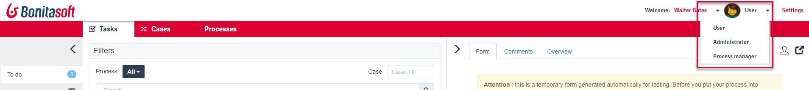
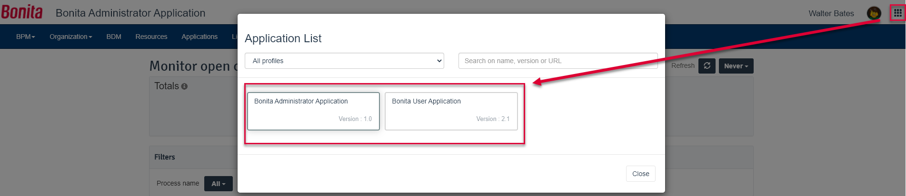

# Navigation between User Interfaces

## In Bonita Portal
The default Portal profile is User. From there, the user can navigate to their other profiles.   
<!--{.img-responsive}-->

## In Bonita Applications 
Users may be mapped with several profiles, opening permissions to access several applications.
Or maybe one given profile is mapped with several applications.
In both cases, the user can navigate between applications they have the permissions to access:
  1. The user clicks on the _mosaïc_ icon in the Application header
  2. The user selects the tile of the application to navigate to
<!--{.img-responsive}-->

