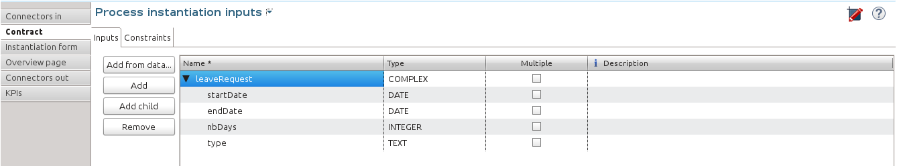

# How to optimize the user task list

This howto applies to the legacy task list -Bonita BPM 6.0 to 6.5.x versions- as well as the [new task list - from Bonita BPM 7.3 and above](user-task-list.md).

Goal: Leverage Studio and task list configuration to optimize user comfort and efficiency.

## In the Studio: Task display name, display description, and description after completion

During process modeling, a task is given a generic definition in the process definition, so its name is generic, such as "Contract validation".
Within a process instance (case), this task name must be contextualized with business information specific to the case so that, in the user task list, all tasks don't look the same.
This allows users to efficiently identify and pick the right task in the list.

This howto uses the same process example than in [How to control and validate forms in the UI Designer](manage-control-in-forms.md): a leave request management process.

### Create the process example

First, create a new diagram.
Then model the process in the first pool: since the instantiation of a new leave request happens at pool level, just rename the default _human task_ into "Request validation", and add a _terminate end_ event that you can rename "Happy end".
Rename the pool into "leave request management", and the lane into "Manager", as shown here:


Then, define a business object that will hold the leave requests data when the process instances are ongoing, and store it when the instances are archived: In Bonita BPM Studio menu, go to Development > Business Data Model > Manage option, and add a business object named _LeaveRequest_, with 2 attributes (for the example):

_startDate_: first working day taken as vacation, as a DATE
_endDate_: last working day taken as vacation, as a DATE
_requestorName_: employee who submits the leave request, as a STRING
_status_: whether the task is submitted or approved, as a STRING

To allow this business object to be instantiated with each process instance, create a business variable at pool level:
1. Click on the pool.
2. In the **Data** panel, **Pool variables**, **Business variables** table, **Add** a business variable named _leaveRequest_.
3. For **business object**, choose **LeaveRequest** (the default value if you only have one object).

Then, to make sure the process gets the information it needs to start a new instance, create a contract:
1. In the **Execution** pane > **Contract** tab, click on **Add from data...** to generate the contract inputs from the business variable.
2. Choose the **Business variable** option, and then the **leaveRequest** variable.
3. Click **Next**
4. Unselect **status** as this is not an information that the process needs to instantiate
5. Click **Preview**
6. In the script, add `leaveRequestVar.status == "submitted"` to set the default value of the request once the request (instantiation form) is submitted
7. Also initialise `requestorName`
```groovy
def initiator = BonitaUsers.getProcessInstanceInitiator(apiAccessor,processInstanceId);
leaveRequestVar.requestorName = "$initiator.firstName $initiator.lastName"
```
8. Click "Finish", "OK", and "OK"
In the **Execution** pane > **Contract** tab, a complex contract input is created, mapped on the **leaveRequest** business variable.
Each entry of the contract is bound to a business variable attribute, as shown here:



A script is also automatically generated, that writes contract inputs values in default business data attributes when the process is instantiated.

For test purposes only, the Studio generates a form based on the contract requirements. We will use it in this howto.

### Configure the display options

The requester's name, as well as the request start date, end date, and status can be displayed in the task list for each case (request).
The change in status, from _submitted_ to _approved_ will be noticed when switching from the "To do" task filter to the "Done tasks" filter.

To configure the display options:
1. Select the **Request validation** task
2. Go to **General** pane > **Portal** tab.

As a good practice, we advise to display static information that defines the task in the **Display name** field, and dynamic information that changes over the life of the case in the **Display description** field:
3. Next to the **Display name** field, click the **pencil** icon to display the expression editor.
4. Select the **Script** expression type and create the script. Make sure the result of your script will not exceed 255 characters.

```groovy
[Vincent's input: "Leave validation:" requestorName: startDate - endDate ]
```
Click **OK**.
Then address the status, a dynamic information, in "Display description":
5. Next to the **Display description** field, click the **pencil** icon to display the expression editor.
6. Select the **Script** expression type, and create the script. Make sure the result of your script will not exceed 255 characters.

```groovy
[Vincent's input to display the status ]
```
Click **OK**
To display the new status once the request is approved, in the **Done tasks** field, use "Display description after completion":
7. Next to the **Display description after completion** field, click the **pencil** icon to display the expression editor.
8. Select the **Script** expression type, and create the script. Make sure the result of your script will not exceed 255 characters.

```groovy
[Vincent's input to display the status "approved" ]
```
Click **OK**

9. Save the diagram
10. Run the pool.
11. Fill out the default instantiation form by picking two dates in the date picker widgets and submit

When you are back to the task list, you can see that the task name is contextualized. It is computed once, when the task becomes ready.
To display the **Description** column and view the _submitted_ status:
1. Click on the **setting wheel** icon at the top right of the list
2. Select **Description**
3. Click outside the settings box

The table settings have changed to display the **Description** column. It will be stored in the local storage of the browser.

Perform the task.
Now click on the **Done tasks** filter, configure your list to display the **Description** field, to see the _approved_ status for the task.

## Search a task name based on word-based search

To allow users to efficiently search by task name, you can configure the search option: from _starts by_ (the beginning of the whole task name string), you can switch to _word-based search_ (the beginning of every word in the task name).

To do so, go to [word-based search](using-list-and-search-methods.md#word_based_search).

:::info
**Note:** Setting the word-based search may result in lesser performance, with some delay experienced by users on the display of search results.
:::
