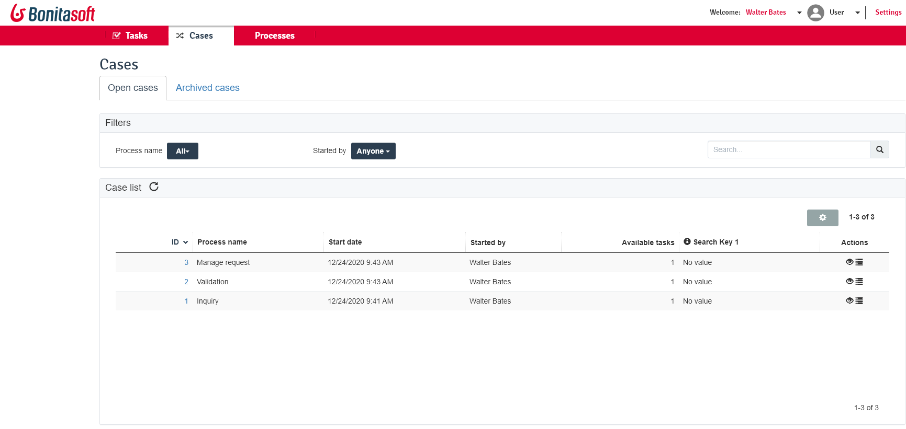
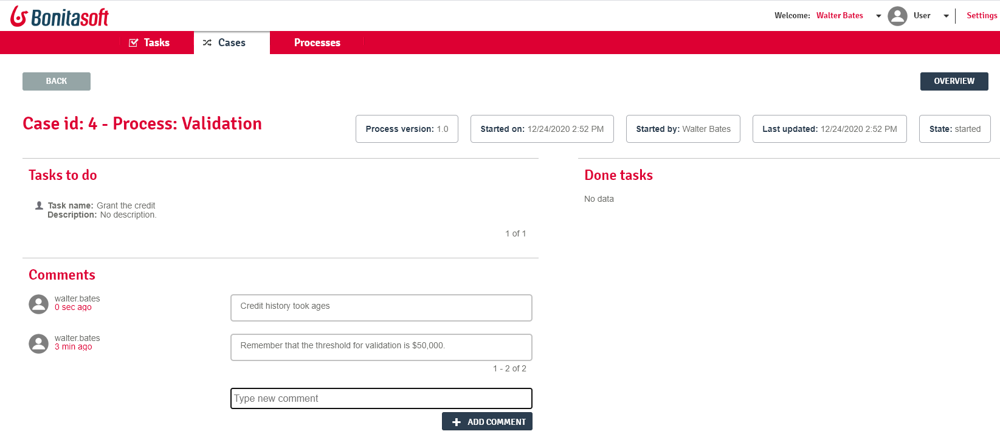
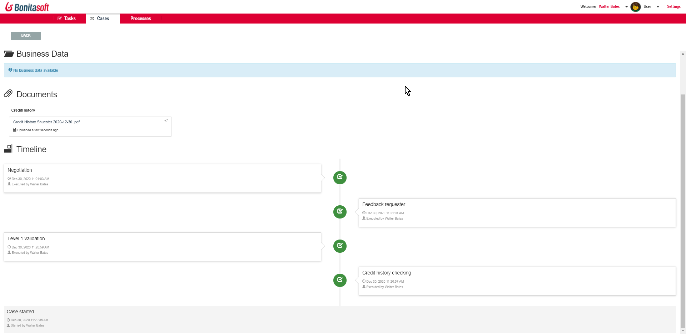

# User Case list in Bonita Portal

This page explains what a user with the _User_ profile in Bonita Portal can see and do about cases (the process instances).

_Users_ can view a list of the cases they are involved in, filter cases, and search for a case.  
Then on a given case, they can view the case overview, access the case details, and access the list of tasks to do and/or done in the case.

## Case list

Here is a view of the User case list.
<!--{.img-responsive}-->

This list displays the cases in which the logged user is involved: 
  * They started the case, from the [process list](user-process-list.md) or an application
  * AND/OR they have done tasks in this case earlier, from the [task list](user-task-list.md) or an application

### Open and Archived cases

At the top of the page, two tabs act as the first filter of the list: _Open cases_ and _Archived cases_.  
Obvious differences between the two:
  * Open cases have an _Available tasks_ column but not the archived cases
  * Archived cases have an _End date_ but not the open cases
  
Less obvious difference:
Users can add a comment in an open case, but cannot anymore in an archived case.  
Comments are described a little below in this page.

### Filter by process
The default filtering option is "All", but you can click on the drop down list widget to view all process names and select the one of your interest.
Once clicked, the list is refreshed and only displays the cases of the selected process.

### Filter by initiator
The default filtering option is "Anyone", but you can click on the drop down list widget to view the second option "Me".  
If you select "Me", the list is refreshed and only displays the cases you have started.

### Filter by search key

::: info
This feature has been made available in the Community edition since Bonita 2021.1. 
:::

#### Search keys

Search keys are data attached to the process definition to distinguish between cases of the process. For example: the customer's name for a request.  
It eases the search for a case if the case Id is not what users favor when referring to a case.  
They are instantiated through operations, mainly after the instantiation form has been submitted and the case starts.  
They can be updated anytime during the lifetime of the case.  
Search keys are optional and it is possible to define up to five search keys for a process.   
By default, the case list only displays one search key, but through table configuration, it is possible to show the five columns dedicated to search keys (see "table display preferences" below).  
Technical note: There is a database index for each search key.  
To know more about how to implement search keys, go to the [search keys](define-a-search-index.md) page. 

#### Search keys filter results

Only cases which have been given values for their search keys during the execution of the case will be filtered.
Search can be done on the value of a search key. 
By default, the search is performed on the first word of the string.  
In case the string contains several words and you would need the search to be performed on the beginning of either word, you need to activate the [word-based search](using-list-and-search-methods.md#word_based_search).  
The search is launched automatically after a character is typed, with no need to press the Enter key.  

The three filters can be activated together to refine the relevance of the cases displayed.  

### Table display preferences
By clicking on the cog icon at the top right of the table, users can define their display preferences:
  * Number of cases displayed on each page of the table: select 25, 50, 100, or 200. 
    Depending on the quality of the Internet connexion, less items will display faster.
  * Columns that are the most useful: tick or untick the checkboxes
  * Reorder the columns: hover the item to reorder, click on the handle on the left, hold and move the item up or down, release the mouse click at the right location

## Case details
At the begining of each row, the case Id is a clickable link to see more details for the case.
Here is an example of the case details page.
<!--{.img-responsive}-->
It displays: 
  * At the top, all metadata about the case
  * Second zone: data about the pending tasks of the case if the loggued user can do them. Open cases only
  * Same zone: done tasks in this case
  * Third zone: comments list
  * Last zone: the possibility to add a comment. Open case only

## Case overview
From the case details (button on the top right), or from the case list (_eye_ icon at the end of a case row), you can access the case overview.
To know more about the customization of the case overview, go to the [Case overview](uid-case-overview-tutorial.md) page.
Here is an example of the case overview provided by Bonita.
<!--{.img-responsive}-->

It displays:
  * The current values of the business variables of the case
  * The documents currently managed by the case
  * A bottom-up chronology of some events that happened in the case: case start and human tasks executed, each one with a timestamp and actor.

## Tasks to do/done in the case
From the _list_ icon at the end of each row, you can access the list of tasks in the case.
For an open case, it can also be accessed through the "Available tasks" column of the case.
  * Open case: it navigates to the [task list](user-task-list.md) of tasks to do in the case
  * Archived case: it navigates to the [task list](user-task-list.md) of done tasks in the case
