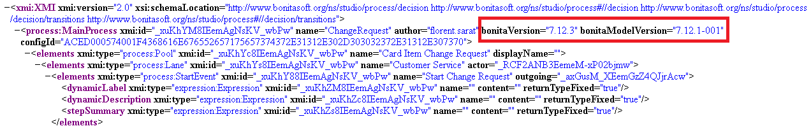

# Bonita Versioning
Discover how Bonita manages its product and artifacts versions and how it can impact your projects

## Product Versions

After years of semantic versioning, Bonita now follows calendar versioning: YYYY.n, since version 2021.1:
* YYYY year of the release
* n is the release number. Two versions are released every year.

### Technical Id

A technical Id also exists and it follows the usual semantic versioning X.Y.z:
* X is the major version number. It changes when non-backward compatible changes are implemented.
* Y is the minor version number. It version changes when backward compatible features are added. A minor version is released every six months to improve continuously Bonita.
* Z is the maintenance version number. The maintenance versions contain fixes. Maintenance versions are released every month between two minor versions for the current minor version. These versions are cross-compatible by default for the same minor version.

For example, upgrading from a 7.12.2 to a 7.12.5 will not require any migration. However, migrating from a 7.11.5 to a 7.12.2  or to  8.0.1 will require a migration.

Technical Id Bonita version correspondence table 
|Bonita Version            |Technical Id                          |
|--------------------------|--------------------------------------|
|2021.1                    |7.12.z                                |

## Artifact version

In addition to the product version, most artifacts have a model version. The development suite (Studio and UI Designer
) uses this model version to determine if the corresponding artifact is compatible.
If the artifacts are incompatible, then either the development suite migrates the artifacts (when the model version is lower than the development suite version), or you will have to upgrade your development suite to a compatible version.

Example:

In the below case, my diagram model version is "7.12.1-001". I will not be able to open it with a 7.11 Studio but I will be able to open it without migration with any 7.12 Studio. Finally, if I'm using a 7.13 Studio my diagram will be migrated.

The following artifacts have model versions:
* Diagrams
* Organization
* Business Data Model
* BDM Access control
* Applications 
* Pages
* Forms
* Fragments
* Layouts
* Customer Widgets

These model versions should not change between maintenance versions of a given minor version (e.g. between a 7.12.5 and a 7.12.3). This means that no migration is needed in production or the Studio when changing the maintenance version.

::: info
**Note:** Changing the minor version does not imply that the model version of all artifacts will change. Meaning that in some cases, upgrading to a new minor will not require migration.
:::

## Version checks in the development suite

### Studio
The Studio will check the model version of every artifact of a given project when cloning or importing it. The artifact model version will also be checked when importing artifacts individually. 

The model versions of all artifacts are also checked when deploying a project. Finally, the model version is checked when an artifact is opened.

To check the compatibility of your artifacts manually, you can use the "Validate" action in the project's context menu or via the File menu.

You will not be able to work with incompatible artifacts or deploy them. You will be able if you desire to migrate the older artifacts.

### UI Designer

The UI Designer will check the model version of all artifacts when it is launched and when a given artifact is opened. You will not be able to work with incompatible artifacts. You will be able if you desire to migrate the older artifacts.

:::warning
**Warning**: Artifact migration is not reversible. Once the Studio or UI Designer has migrated an artifact it is no longer compatible with the previous version of the development suite.
:::
