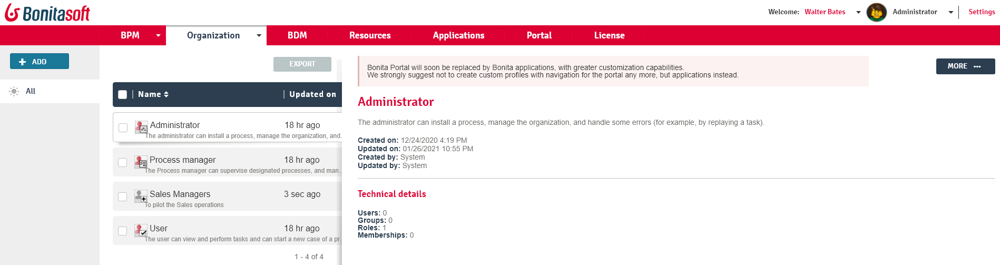

# Profiles management in Bonita Portal

This page explains what a user with the _Administrator_ profile can do with profiles in Bonita Portal.
In all Bonita editions, those users can change the mapping between a provided profile and the organization entities.
In Enterprise, Performance, and Efficiency editions, they can also create new profiles and edit them.

Here is a view of this page:
<!--{.img-responsive}-->

A profile is an indirection to some entities of the organization: users, groups, roles, and/or memberships.
Profiles work as permissions to give access to:
- [Living Applications](applications.md)
- Defined objects and attributes of the BDM (through [BDM Access Control](access-control-api.md))
- [REST API extension permissions](rest-api-authorization.md)
- Navigation (menus) of Bonita Portal

One organization entity can be mapped to several profiles. In Bonita Portal, a loggued user can switch between his/her profiles in the navigation bar.

In development, the creation and edition of profiles is done through the [profile editor](profileCreation.md) in Bonita Studio.   
In non-production and production, an Administrator can use the _Organization_>_Profiles_ menu of Bonita Portal.

::: info
Changing the mapping of a profile on a non-production or production Runtime may lead to inconsistencies when updating the project or deploying it on another server.  
It should only be done to recover from an error temporarily. We strongly encourage you to report all changes in the sources profiles files of the project.
:::

## View profiles
In _Organization_/_Profiles_, the list shows all profiles sorted by alphabetical order:
- Three provided profiles: "User", "Administrator", and for Enterprise, Performance, Efficiency, and Teamwork editions,"Process Manager"
- All custom profiles created, for Enterprise, Performance, and Efficiency editions

## Default profiles 
### User
By default, they access the User navigation of Bonita Portal. It includes:
  * a [Process list](user-process-list.md)
  * a [Case list](portal-user-case-list.md)
  * a [Task list](user-task-list.md).
This profile is also the only one mapped with Bonita Mobile Portal.  
This profile is also mapped to the [Bonita User Application](user-application-overview.md), bringing the same value but with more customization options.
  
### Administrator
By default, they access the Administrator navigation of Bonita Portal. It includes:
  * [Process Management](_process-maintenance.md) and [Analytics](analytics.md)
  * [Organization Management](organization-in-bonita-bpm-portal-overview.md)
  * [Business Data Model Management](bdm-management-in-bonita-bpm-portal.md)
  * [Applications Management](applications.md)
  * [Portal Look & Feel Management](managing-look-feel.md)
  * [License Information](license-info.md) (Enterprise, Performance, Efficiency, and Teamwork editions only)
  This profile is also mapped to the [Bonita Administrator Application](admin-application-overview.md), bringing about the same value but with more customization options.

### Process manager
This profile is available for Subscription editions only.
An employee mapped to the **Process manager** profile has limited administration rights for activities related to the processes they manage, as defined by the Administrator.

::: info
**Note:** In Bonita ACME organization, all users have the role **Member**, and the role **Member** is mapped to all default profiles.  
This simplifies process testing (log in as any user to see any Portal content). 
:::

## Custom profiles

In addition to the default profiles, users of Enterprise, Performance and Efficiency editions can create [custom profiles](custom-profiles.md).  
To create a custom profile, use the [profile editor](profileCreation.md) in Bonita Studio, and map it to entities of the organization.   
If a custom profile is created to give access to custom content in Bonita Portal, its Portal menu (navigation structure and pages) must also be defined in the profile.
We highly recommend to create the profiles in Bonita Studio so the custom profiles are versioned with the whole project and maintained consistently.   
In a production environment, if updating a profile is needed to recover from an issue temporarily, the Administrator can use the _Organization_>_Profiles menu.
