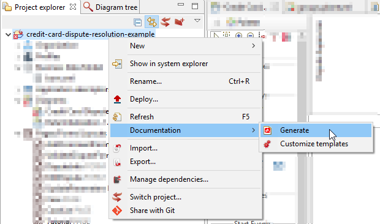
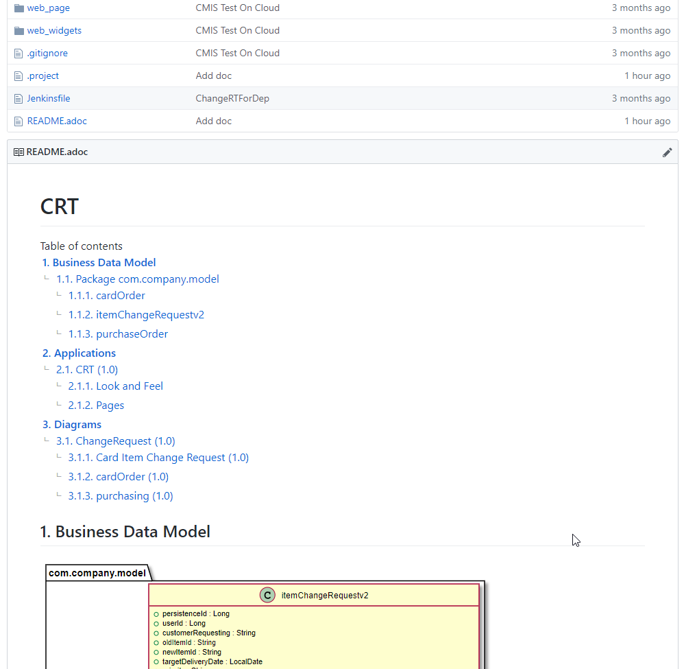

# Generate project documentation
How to generate the project documentation in Bonita Studio.

::: info
**Note:** For Enterprise, Performance, Efficiency and Teamwork editions only.
:::

## Overview

To collaborate efficiently with business users, Bonitasoft studio allows you to generate and export the documentation of your project.

The documentation generator will use mostly information stored in the objects of the studio such as the processes or tasks. 

::: warning
In order to fully use this feature, we recommend that you use extensively the provided description fields.
:::

As we know that your needs in term of documentation can greatly vary from one project to another or from one team to another, you can easily customize both the generated documentation and the templates used by the generator.

To perform these customizations, you will need [Groovy](groovy-in-bonita.md) and [asciidoctor](https://asciidoctor.org/) knowledge.
However, we provide examples to make your life easier and a framework so that business-oriented users can also participate in the documentation.

## Generating the documentation

Right-click on your project and select the `Documentation > Generate` menu:

  

It will trigger the documentation generation based on the default templates. 
The following artifacts will be created in the project's root folder:  
* `README.adoc` file in the project root folder. It is the generated documentation in asciidoc format. Double click on it to edit with the Studio's asciidoc editor or just to view it.
* A `documentation` folder containing the sources for the documentation:  
	* `.plantuml` files: UML diagrams  
	* `images` folder: all the images used in the documentation  
	* `static` folder: to store static documents that can be imported in the documentation.  

## Customizing the documentation

### Customizing the generated document
_Required skills_: [asciidoc](https://asciidoctor.org/docs/asciidoc-syntax-quick-reference/) syntax

Once the file is generated you can fine-tune it by modifying the output document.
To do, open the `README.adoc` file with the Studio. The embedded editor is divided into three vertical panels:
* On the left, the source code of the documentation in asciidoc format  
* In the middle, the HTML preview of the document 
* On the right the document outline  

Now you can edit the source code to customize the documentation. To refresh the preview, save your source code. 

::: warning
**Warning:** If you launch the documentation generation again it will overwrite your README.adoc file. To avoid this, rename your file.
:::

### Customizing the documentation templates

Customizing the documentation templates allows you to industrialize your documentation generation. You will not have to customize manually the generated document it will already suit perfectly your needs!

To customize the generation templates, right-click on your project and select the `Documentation > Customize templates` menu.  
The following artifacts will be created in the project’s `documentation` folder:  
* A `templates` folder
	* `src` folder: the template source files
	* `groovydoc` folder: the groovy documentation for the Project data model and the template tools.  
	* `README.adoc` file: the instructions to help you customize the templates.

## Exporting the documentation

The Studio documentation editor allows to export your documentation in two formats:

### Export as PDF

As a PDF file thanks to the  button

 
 
### Export as HTML

To generate an HTML output from an asciidoc document you can use many tools. The most straightforward way is to install asciidoctor command line interface like explained in the [official documentation](https://asciidoctor.org/docs/install-toolchain/).

Then follow the instructions of the [official documentation](https://asciidoctor.org/docs/user-manual/#html) for more information to generate a `.html` file from an `.adoc` file. The `.html` file needs the `documentation` folder to be at the same level to properly display the images assets.

There are also other solutions to process asciidoc documents using [Maven](https://asciidoctor.org/docs/asciidoctor-maven-plugin/) or [Gradle](https://asciidoctor.org/docs/asciidoctor-gradle-plugin/) plugins.

### View in GitHub or GitLab

If you are using [GitHub](https://github.com) or [GitLab](https://about.gitlab.com/) for your project, your documentation will be displayed below the content of the repository (like any readme file).
All you need to do is generate your documentation and push it to your repository thanks to ["Team" features](workspaces-and-repositories.md).

## Collaboration thanks documentation generation feature

The documentation will help you collaborate with business users to build processes and applications that match perfectly their needs.

### Fail fast

The business users or citizen developers have the functional inputs required for the implementation. However, as the project advances there can be a misalignment between the implementation and business needs.

Thanks to the documentation generator, as a developer you can share the current implementation status without having to build and deploy. This means that this sharing can take place at an early stage of the project's lifecycle. 

Potential issues, misunderstandings or inconsistencies will be detected at a minimal cost.

Therefore, we will strongly recommend that you generate regularly the documentation to share it with the stakeholders.

#### Project Quality

To have maintainable and understandable projects, we strongly recommend that to fill out description fields.

The generated documentation will show all the missing descriptions and will make it easier to request the required information.

### Improve your processes

The documentation also provides an easy-to-access baseline of your processes that can be then used to brainstorm the next improvements.

### Explain

The documentation will help onboard new users of the processes and applications or anyone that will be working on the project. No need to install studio all you need is access to the documentation!
