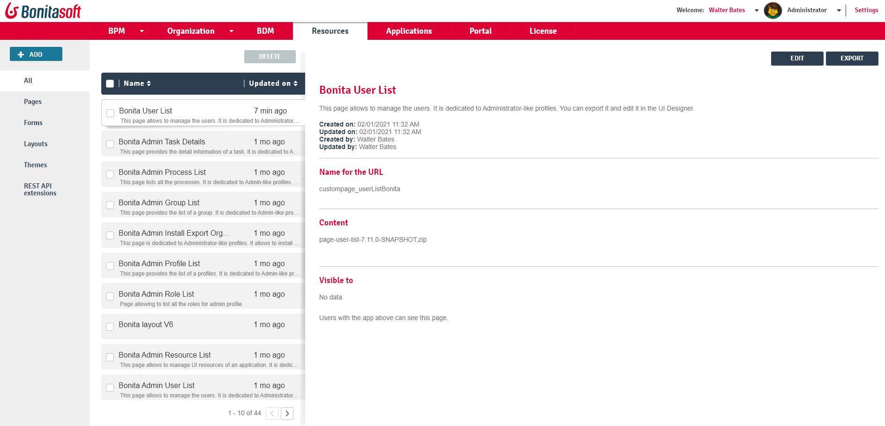

# Resources management

This page defines the term "Resources" and explains what a user with the _Administrator_ profile in Bonita Portal can see and do about resources.  

_Administrators_ can view a list of the resources filtered by type, install new resources, update existing resources, or delete resources.  

Here is a view of the page:
<!--{.img-responsive}-->


## Resource definition

A resource is deployed in Bonita Portal to create the User Interface of a Living Application: it can be a page, a layout, a theme, a REST API extension, or a form that will be used by several processes so it is better to store it at platform level than within the process .bar file.  

A resources is packaged as a .zip archive that contains a `page.properties` file, a resources directory and an index file.  
* The `page.properties` file contains the metadata for the page.

For example: 
```
#The name must start with 'custompage_'
name=custompage_layout
displayName=Application layout page
description=This is a layout page dedicated to new born living applications. It is created and editable using the UI designer. It allows to display an horizontal menu, and an iframe. The menu allows to target some pages and the iframe define the area to display those targeted pages.
resources=[GET|living/application,GET|living/application-page,GET|living/application-menu]
contentType=layout
```

* The `resources` directory contains all the public files of your resource (for example `index.md`, images, Javascript files, CSS files).  

* Except for REST API extensions, the zip archive must contain at least one of the following files:
   * An `index.html` file in the `resources` directory
   * An `Index.groovy` class at the root of the archive with, optionally, libraries
   * A `resources/theme.css` file for applications themes

If a resource contains both `Index.groovy` and `index.html`, the Groovy class takes precedence.  

## Permissions for resources

If your resource needs to perform requests to Bonita REST API, 
you need to specify the permissions that a user needs to have in order to access those API. 
These permissions are defined in the `page.properties` file. If your resource is a page written in Groovy and uses the Bonita Engine Java APIs, you do not need to specify permissions.
For each REST resource accessed in other resources, specify the authorization needed for each method used. 
You can find examples of the default resources in [`resources-permissions-mapping.properties`](BonitaBPM_platform_setup.md).

The following example shows the permissions defined for a page that enables a user to view but not update organization information:
```
#The name must start with 'custompage_'
name=custompage_orgViewer
displayName=Organization viewer
description=Organization viewer page. You cannot modify the organization from this page.
resources=[GET|identity/user, GET|identity/personalcontactdata, GET|identity/professionalcontactdata, GET|identity/role, 
   GET|identity/group, GET|identity/membership, GET|customuserinfo/user, GET|customuserinfo/definition, GET|customuserinfo/value] 
contentType=page  
```

## Add a resource

To add a resource onto Bonita Portal, import a .zip archive that contains the resource definition.  
To do so:
1. Go to _Resources_. You will see the list of all resources, and a filter for each type of resource ("Page", "Form", "Layout", "Theme" and "REST API extension").
2. Click on _Add_.
3. In the _Archive_ field, specify the .zip archive to be added. Click in the field, then specify the location and filename in the popup.
4. Click on _Next_.
5. Review the permissions needed to view this page.
6. Click on _Confirm_.

The resource is installed.  

If you have specified a resource permission that is not defined in the [REST API authorization configuration](rest-api-authorization.md) and REST API authorization is configured to be on, you will see an error message.

After a resource is installed, it can be used in an [application](applications.md).

::: warning
**Warning**: As the deployment of resources automatically creates the appropriate resource permissions mapping, be careful not to [push a configuration](BonitaBPM_platform_setup.md#update_platform_conf) that does not contain the latest permissions updates. This would overwrite the deployed configuration. To avoid doing so, pull the latest configuration, edit the needed elements and push it back to Bonita Runtime in a pretty short amount of time.
:::

<a id="export"/>

## Export a resource

You can export a resource from Bonita Portal. The page is exported as a .zip archive.
To do so:
1. Go to _Resources_. You will see the list of all resources, and a filter for each type of resource ("Page", "Form", "Layout", "Theme" and "REST API extension").
2. Select the page you want to export.
3. Click on _Export_.
4. In the popup, specify the name and location for the exported zip archive, and click on _OK_.

The .zip archive is exported to the location you specified.

<a id="modify"/>

## Edit a resource

To edit a resource in Bonita Portal, upload a .zip archive containing the new version.  
To do so:
1. Go to _Resources_. You will see the list of all resources, and a filter for each type of resource ("Page", "Form", "Layout", "Theme" and "REST API extension").
2. Select the page you want to update.
3. Click on _Edit_.
4. To upload a new resource definition, click in the "Page archive" field and specify the new .zip archive to import.
5. Click on _Next_.
6. Review the permissions needed to view this page.
7. Click on _Confirm_.

The resource is edited.

## Delete a Resource

To delete a resource:
1. Go to _Resources_. You will see the list of all resources, and a filter for each type of resource ("Page", "Form", "Layout", "Theme" and "REST API extension").
2. Check the checkboxes of the pages you want to delete.
3. Click on _Delete_.

The selected resources are deleted.

::: info
Note: Either all the selected resources are deleted, or no resources are deleted. If you have selected a page, a layout or a theme that are used in an application or a custom profile, you will see an error message listing these resources and the User Interfaces where they are used. In the case, none of the pages you selected is deleted.
:::
