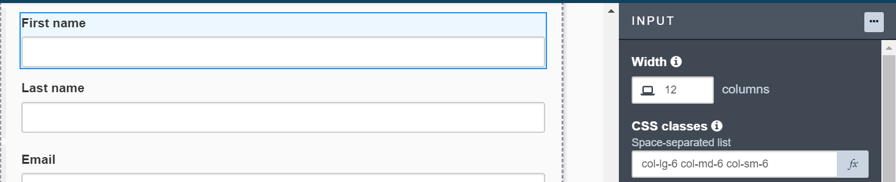
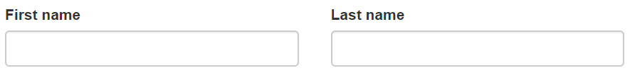
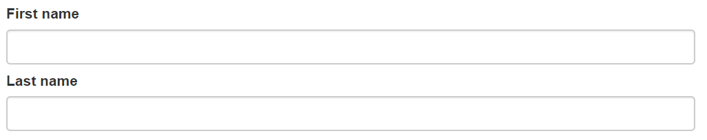

# Create a responsive web application with Bonita Community edition

To build a responsive page/form based on different screen sizes using UI Designer, there are several predefined bootstrap CSS classes.

By default, the preview of Bonita UI Designer in Community edition is mobile first approach. The bootstrap CSS classes for grid columns
such as; `col-lg-12, col-md-12, col-sm-12, col-xs-12, etc.` helps Community users to build responsive application(s).

According to grid system, bootstrap predefined CSS classes for different screen resolutions explain 3 major things;

- `col` : grid columns
- `lg`, `md`, `sm`, `xs` : lg stands for large screen size whereas md for medium, sm for small, and xs stands for extra small screen size devices. 
- numbers (`1 to 12` ) : number of grid column(s).

Grid columns are created by specifying the number of twelve available columns. For example, .col-lg-6 is equal to two equal columns in a row.

Example:

For instance, to make a responsive input field in UI Designer, user can add col-lg-6, col-md-6, and col-sm-6 to the CSS classes property.
These CSS classes will divide the given row into 2 columns where an input field will take half the row width in large, medium and small screen 
size devices whereas it will take the full width of the row in mobile or extra small screen size devices as it is defined as col-xs-12 by default. 

Output:

On large, medium, and small screen devices;

On extra small screen (mobile) devices;

For more details about bootstrap grid system, click [here.](https://getbootstrap.com/docs/3.3/css/#grid)
