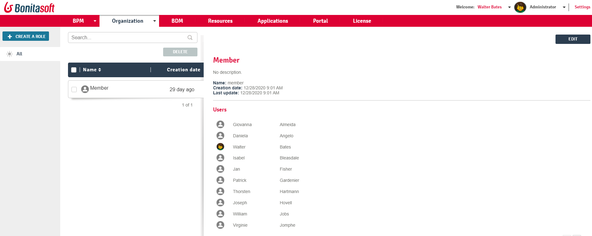

# Administrator Role list in Bonita Portal

This page explains what a user with the _Administrator_ profile in Bonita Portal can see and do about roles in the organization.  
Roles can be defined in the organization, attached to users and used to map actors.

Here is a view of this page:
<!--{.img-responsive}-->

## Create a role
1. Go to the _Organization_/_Roles_.
2. Click on the _Create a role_ button in the top left corner.
3. In the pop-up window, enter the avatar (picture) to represent the role (optional).
4. Enter the name, the display name, and a description of the role.
5. Click on_Create_. The new role will be displayed in the list of roles.

## Assign a role to a user
1. Go to the _Organization_/_Users_. The list of users in the organization will be displayed.
2. Click on a _User_.
3. Click on _More_
4. In Memberships, click _Ad_.
5. Choose the group and role for the user.
6. Click _Add_.

## Edit a role
1. Go to the _Organization_/_Roles_.
2. Click a checkbox to select a role.
3. Click _Edit_.
4. In the popup window, update the role information.
5. Click _Save_.

## Delete a role
1. Go to the _Organization_/_Roles_.
2. Click a checkbox to select a role.
3. Click _Delete_.
4. In the popup window, click _Delete_.

## More information about a role
1. Go to the _Organization_/_Roles_.
2. Click a checkbox to select a role. A list of users who have this role is displayed.
