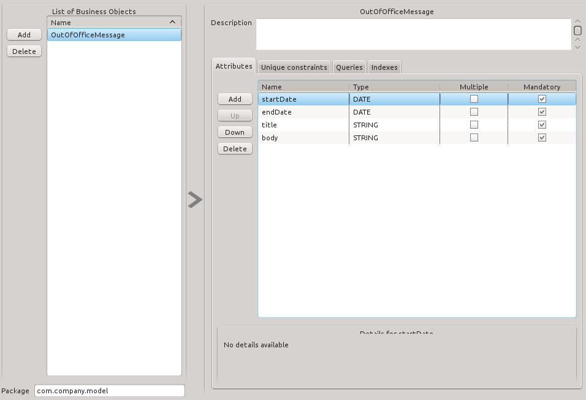
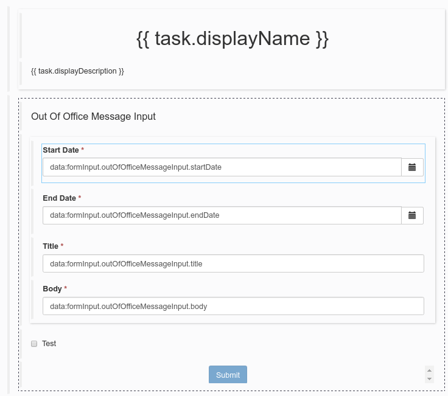
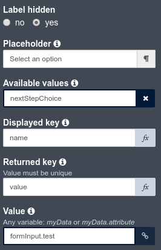
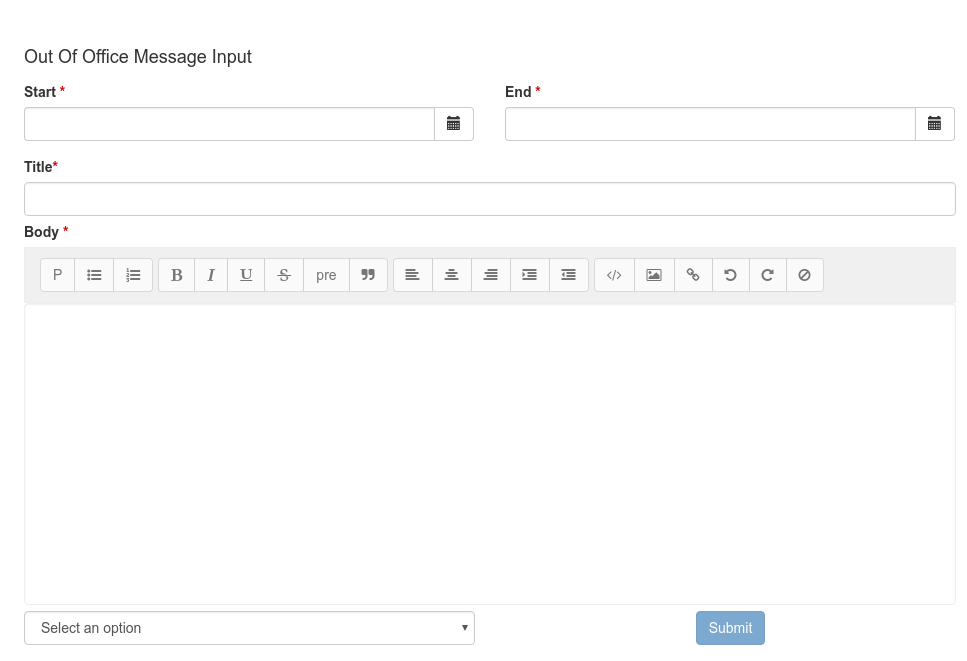
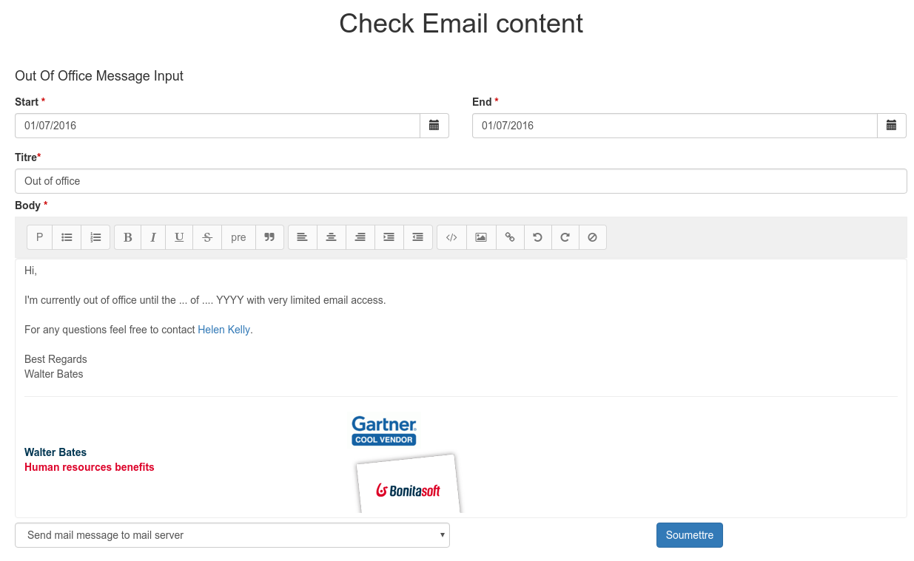

# How to use the rich textarea widget in a mail template

Learn how to use a mail template in a form with the rich textarea widget: the leave request management process example. 

## Out of office message process

Usually, when leaving for a vacation, you set your mail account up with an out of office message to notify your senders that you are not here until a specific date.

You will design a process using Bonita:  
First, draw the wireframe of the process in Bonita Studio.  
The process consists of a :
* a start event
* a human task asking for the user to check the email content which will be send, the dates of its vacation and whether it wants to test the mail before submitting it to the mail server.
* a service task sending the mail to the user
* a service task which sends the out of office mail message to the mail server
* an end event

The process will look like this:

 <!--{.img-responsive}-->

Conditions are set on the transition out of the _Check Email content_ task allowing to know which path to use.

We create a **Business Data Model** to hold the user informations :
* _startDate_: leave date start as a **DATE**
* _endDate_: leave date end as a **DATE**
* _title_: the mail title as a **STRING**
* _body_: the mail body as a **STRING** with a _length_ of 2048

 <!--{.img-responsive}-->

A business object variable will be created at pool level, named **outOfOfficeMessage**. It will to be initialized via a Groovy script with the mail template of the out of office message.  
The template will be filled with the initiator information and its manager contact:

```groovy
import org.bonitasoft.engine.identity.ContactData;
import org.bonitasoft.engine.identity.User;

def ooom = new com.company.model.OutOfOfficeMessage();

User u = BonitaUsers.getProcessInstanceInitiator(apiAccessor,processInstanceId);
User manager = BonitaUsers.getProcessInstanceInitiatorManager(apiAccessor,processInstanceId);

ContactData managerData = BonitaUsers.getProcessInstanceInitiatorManagerProfessionalContactInfo(apiAccessor,processInstanceId);
ContactData userData = BonitaUsers.getProcessInstanceInitiatorProfessionalContactInfo(apiAccessor,processInstanceId)

ooom.setTitle("Out of office");
ooom.setBody("""
<p>Hi,<br>
<br>
I'm currently out of office until the ... of .... YYYY with very limited email access.<br>
<br>
For any questions feel free to contact <a href="mailto:${managerData.email}">${manager.firstName} ${manager.lastName}</a>.<br>
<br>
Best Regards<br>
${u.firstName} ${u.lastName}
</p>
<div dir="ltr">
// ...
// Mail signature
// ...
</div>

""");
ooom.setStartDate(new Date());
ooom.setEndDate(new Date());

return ooom;
```

This process instantiation do not hold any form (_no form_ in the **Execution > Instantiation form** tab) and a business object will be created with a groovy script setting the mail template.

### Check email content task

The _Check email content_ human task will consists of a contract matching the Business object **outOfOfficeMessage** for it to be mapped with the contract output. We also will need a local variable which will allows to know if the mail needs to be tested.  
This variable needs to be mapped with a contract data too.

The contract will looks like this :

 <!--{.img-responsive}-->

And the operation pane will look like this:

 <!--{.img-responsive}-->

#### Out transistion

This task has two possible transition :
* the transition to the _Send test email_ is condition if the local variable **test** is true
* the transition to the _Send Message to Mail Server_ is condition if the **default flow**

### Send test email service task

This task allow to send a test email to the process instance initiator for him to check if the mail renderring is correct.

Therefore, we will use the **EMAIL (SMTP) Connector** on the task out step.  
The connector properties will be :
* The _to_ and _from_ properties of the connector will use groovy script to retrieve the appropriate address:
  ```groovy
  BonitaUsers.getProcessInstanceInitiatorProfessionalContactInfo(apiAccessor,processInstanceId).email;
  ```
* The _Subject_ will use a groovy script too to retrieve the business variable property:
  ```groovy
  outOfOfficeMessage.title
  ```
* The _Message_ will use a groovy script too to retrieve the business variable property:
  ```groovy
  outOfOfficeMessage.body
  ```
Once this task is completed, a new _Check email content_ human task is available.o

### Send message to mail server

Here, the out of office mail message has been validated and the way the mail server handle the out of office mail configuration for a given user depends on the mail server provider and will not be detailed here.  
It will use a connector that will send the appropriate information via an external API.

# Form for 'Check Email content' task

On 'Check Email content' task, in the **Execution > Form** pane, use the pencil :fa-pencil: icon to generate a default form from the contract.  
It will look like this:

 <!--{.img-responsive}-->

For a better usability, we can  :
* rename _Start Date_ to _Start_
* rename _End Date_ to _End_
* have both date widget on the same line
* change the checkbox _Test_ to a select box :
  * add a **select** widget below the checkbox
  * create a _nextStepChoice_ JSON variable defining the different choices :
    ```json
    [
        {"name": "Receive a test email in my mailbox", "value": true},
        {"name": "Send mail message to mail server", "value": false}
    ]
    ```
  * set the following properties to the **select** widget:
    * _Label hidden_ to `true`
    * _Available values_ to `nextStepChoices`
    * _Displayed key_ to `name`
    * _Returned key_ to `value`
    * _Value_ to `formInput.test`
    It will look like this:

     <!--{.img-responsive}-->

We need to retrieve the business object _outOfOfficeMessage_ which contains the mail contents.  
We use an _External API_ variable named **outOfOfficeMessage** which uses the **context** variable business object reference link: `../{{context.outOfOfficeMessage_ref.link}}`  

We bind the attributes of **outOfOfficeMessage** to fill the **formInput** variable that is already bound to inputs.  
Change the **formInput** type to _Javascript Expression_ and set the _value_ to:
```javascript
return {
  "outOfOfficeMessageInput" : {
    "title" : $data.outOfOfficeMessage.title,
    "body" : $data.outOfOfficeMessage.body,
    "startDate" : $data.outOfOfficeMessage.startDate,
    "endDate" : $data.outOfOfficeMessage.endDate
  },
  "test" : false
};
```

The variable pane will look like this:

 <!--{.img-responsive}-->

We will take advantage of the **Rich text area** widget to have a nice way to visualize the mail body.  

Add a **Rich text area** widget below the _title_ **input** widget:
* set the value to `formInput.outOfOfficeMessageInput.body` (the same as the _body_ **input** widget)
* set the _Label_ property to `Body`
* set the _Required_ property to `yes`
* set the _Style toolbar_ property to `p, ul, ol`
* set the _Miscellaneous toolbar_ property to `html, insertImage, insertLink, undo, redo, clear`

Click on preview. And the form will look like:

 <!--{.img-responsive}-->

## Run the process

Everything is now ready and the process can be started.

In the Studio, click on **Run**.

An instance of the process is started and a task is available.  
Take it and you will see the following form:

 <!--{.img-responsive}-->
