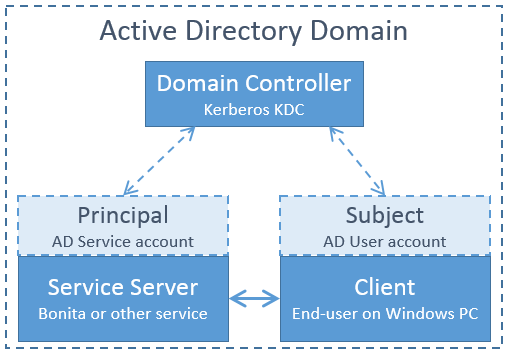
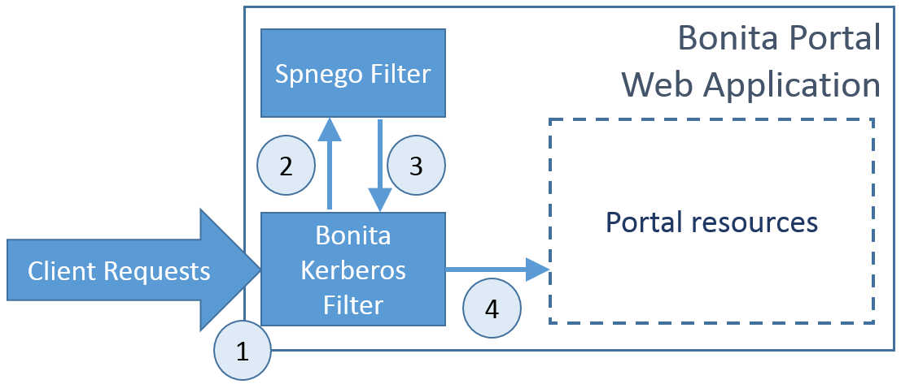

# Single sign-on with Kerberos

:::info 
**Note:** For Enterprise, Performance, Efficiency, and Teamwork editions only.
:::

This pages explains how to configure your Bonita Platform system to use the Kerberos protocol to provide single sign-on (SSO). It assumes you already have a Correctly configured Windows Domain (AD/KDC/DNS services).

This information applies to a Bonita platform deployed from a bundle (Tomcat or WildFly), not to the Engine launched from Bonita Studio. `<BUNDLE_HOME>` refers to the root directory of the bundle.

Kerberos configuration is at tenant level. Each tenant can use a different authentication method (over Kerberos or not).

:::info 
**Note:** Bonita uses [Spnego](http://spnego.sourceforge.net/) library that allows to request tickets using the Kerberos protocol.
:::

## Kerberos single sign-on with Active Directory

Kerberos SSO with AD relies on a minimum on 3 physical machines that are member of the same AD domain:

<!--{.img-responsive}-->

-	Domain Controller: the AD domain controller providing the SSO tickets through the Kerberos KDC component.

-	Service Server: the server on which resides the service we want to access (Bonita for instance). This server is referred to as the "Principal". It uses the credentials of an AD service account and is member of the domain.

-	Client: the client is the end user’s machine. The client is referred to as the "Subject". It uses the credentials of an AD user account and is member of the domain.


## Kerberos overview for Bonita

The target architecture for integrating Kerberos SSO with Bonita and Spnego will involve a custom web application filter: Bonita Kerberos filter.

<!--{.img-responsive}-->

The scenario covered by the filter is the following: 

- The Bonita Kerberos filter intercepts all the requests to bonita portal pages, and checks if the user is already logged in on Bonita 
    
    - If already logged in => Allow the access
    - If not logged in => The request is transferred to the Spnego filter

The Spnego filter will then verify the user’s Kerberos tickets if present or create a new one. After obtaining a valid ticket the filter will store some information (the authenticated user login) in the client request and get back to the Bonita Kerberos filter.
	
- The Bonita Kerberos filter will automatically create a Bonita session and let the user through to access the Portal resources.
	
:::info 
**Note:** The Spnego filter is called programmatically by the Bonita Kerberos filter. It is not deployed as a standard web application filter in the application descriptor (web.xml). This is done in order to allow bi-directional exchanges with the Bonita Kerberos filter (regular web filters are only chained in one direction).
:::

::: warning  
 Bonita "username" should match the authenticated user login returned in the client response. 
 If some users need to bypass kerberos authentication method, you can authorize it by activating an option in the file `authenticationManager-config.properties` (see 2. below). Users will then be able to log in using the portal login page (/login.jsp) provided they have a bonita account and their password is different from their username.
:::

## Pre-installation Environment Checks

In this section, we will describe the minimal set of configuration checks that must be performed before starting the installation.

### Domain Membership Checks

Make sure that the Service Server AND the Client machines are member of the same AD Domain.

### Service Principal Setup

The Windows service that will be connected with SSO needs to be associated with a Principal in the form of an AD service account. This account is called the Service Principal Name (SPN).
Note that this a different account than the machine object on which the service is running.

1- Obtain from your AD administrator the AD service account that is going to be used as the SPN. If none exist yet, follow the steps below else, ignore this.

2- Check that the service account is not already associated to any host by running this command (replace bonita.tomcat with your service account name):

```
setspn -L bonita.tomcat
```
This will list the hosts associated to this service account. There should not be any entry.

3- Run these two commands in order to declare the SPN (bonita.tomcat). The first command will use the simple host name (win2008tomcat):

```
setspn -A HTTP/win2008tomcat bonita.tomcat

Registering ServicePrincipalNames for CN=Bonita Tomcat,OU=Service Accounts,OU=Grenoble,OU=Bonitasoft,DC=corp,DC=bonitasoft,DC=com
		HTTP/win2008tomcat
Updated object
```

Second command with the fully qualified host name (win2008tomcat.corp.bonitasoft.com):

```
setspn -A HTTP/win2008tomcat.corp.bonitasoft.com bonita.tomcat

Registering ServicePrincipalNames for CN=Bonita Tomcat,OU=Service Accounts,OU=Grenoble,OU=Bonitasoft,DC=corp,DC=bonitasoft,DC=com
        HTTP/win2008tomcat.corp.bonitasoft.com
Updated object
```

4- Make sure the SPN is set up correctly by running this command:

```
setspn -L bonita.tomcat

Registered ServicePrincipalNames for CN=Bonita Tomcat,OU=Service Accounts,OU=Grenoble,OU=Bonitasoft,DC=corp,DC=bonitasoft,DC=com:
        HTTP/win2008tomcat.corp.bonitasoft.com
        HTTP/win2008tomcat
```

5- In Active directory, open the technical user properties and go to the account tab. Flag the following values:

	-	Password never expires = true
	-	User cannot change password = true
	-	This account supports Kerberos AES128
	-	This account supports Kerberos AES256
	-	Use Kerberos DES encryption types for this account = should preferably be false

6- Still in the technical user properties, go to the delegation tab and set the following value to true:
	
	Trust this user for delegation to any service (Kerberos only).

7- Update the Java security libraries (Java Cryptography Extension (JCE) Unlimited Strength) to those for Strong Encryption. Depending on your java version, you might have to download some extra files or not.

1. For Java updates > Java 8 u162 and java 9, the unlimited policy is enabled by default. You no longer need to install the policy file in the JRE or set the security property crypto.policy
2. For Java updates < Java 8 u162, you have to download the security libraries [Here](http://www.oracle.com/technetwork/java/javase/downloads/jce8-download-2133166.html)

These libraries need to be put in jre/lib/security and jdk/jre/lib/security.


## Configure Bonita Bundle for Kerberos

You need to execute the following actions in the folder of each tenant for which you want to support authentication over Kerberos.
If you want this configuration to also apply to each tenant created later, make sure to also perform those actions in the *template* tenant configuration folder:
`<BUNDLE_HOME>/setup/platform_conf/current/tenant_template_*` (if you have not started the Bonita bundle yet, the files are located in `<BUNDLE_HOME>/setup/platform_conf/initial/tenant_template_*`)

The bundle already contains the files needed to use Kerberos with Bonita platform.  
To configure Bonita for Kerberos:

1. If you do not already have one:
    1. Download a Subscription edition bundle from the customer portal
    1. [Configure](_basic-bonita-platform-installation) it as needed
    1. Run it a first time, so that the first default tenant is created (TENANT_ID = 1)
    1. Stop it before modifying the configuration files below
	
2. In the tenant_portal folder of each existing tenant: `<BUNDLE_HOME>/setup/platform_conf/current/tenants/<TENANT_ID>/tenant_portal`,
   edit the authenticationManager-config.properties as follows:
   
```
   -->  #auth.AuthenticationManager = org.bonitasoft.console.common.server.auth.impl.standard.StandardAuthenticationManagerImpl
   -->  auth.AuthenticationManager = org.bonitasoft.console.common.server.auth.impl.saml.SAML2AuthenticationManagerImpl
   -->  saml.filter.active = true
   -->  saml.auth.standard.allowed = false
   -->  saml.logout.global = false
   -->  auth.tenant.admin.username = install
   -->  auth.passphrase = BonitaBPM
		#auth.AuthenticationManager = org.bonitasoft.console.common.server.auth.impl.oauth.OAuthAuthenticationManagerImpl
		# OAuth.serviceProvider = LinkedIn
		# OAuth.consumerKey = ove2vcdjptar
		# OAuth.consumerSecret = vdaBrCmHvkgJoYz1
		# OAuth.callbackURL = http://127.0.0.1:8888/loginservice
		#auth.AuthenticationManager = org.bonitasoft.console.common.server.auth.impl.jaas.cas.CASRemoteAuthenticationManagerImpl
		# Cas.serverUrlPrefix = http://127.0.1.1:8180/cas
		# Cas.bonitaServiceURL = http://127.0.1.1:8080/bonita/loginservice
   -->  logout.link.hidden=true 
```
    
Make sure to [set the right tenant admin username](multi-tenancy-and-tenant-configuration#toc2).
It is recommended to also replace the value of the passphrase (property auth.passphrase) which is used by the engine to verify the authentication request.
The value must be the same as in the file **bonita-tenant-sp-custom.properties**.  
If you need some users to be able to log in without having an account on the IDP, you can authorize it by setting the property `saml.auth.standard.allowed` to true. Users will then be able to log in using the portal login page (/login.jsp) provided they have a bonita account and their password is different from their username.

3. In the tenant_engine folder of each existing tenant: `<BUNDLE_HOME>/setup/platform_conf/current/tenants/<TENANT_ID>/tenant_engine/`,
	  edit the file **bonita-tenant-sp-custom.xml** to uncomment the bean passphraseOrPasswordAuthenticationService:

```
	<bean id="passphraseOrPasswordAuthenticationService" class="com.bonitasoft.engine.authentication.impl.PassphraseOrPasswordAuthenticationService" lazy-init="true">
	   <constructor-arg name="logger" ref="tenantTechnicalLoggerService" />
	   <constructor-arg name="identityService" ref="identityService" />
	   <constructor-arg name="configuredPassphrase" value="${authentication.service.ref.passphrase}" />
   </bean>
```

4. In the tenant_engine folder of each existing tenant: `<BUNDLE_HOME>/setup/platform_conf/current/tenants/<TENANT_ID>/tenant_engine/`
  edit the file bonita-tenant-sp-custom.properties as follows:
  
```
		# Authentication service to use. Some are natively provided:
		# authenticationService
		#   * binded to bonita authentication mode
		#   * impl: org.bonitasoft.engine.authentication.impl.AuthenticationServiceImpl
		# jaasAuthenticationService
		#   * to use JAAS
		#   * impl: com.bonitasoft.engine.authentication.impl.JAASGenericAuthenticationServiceImpl
		#   * this is the one to configure SSO over CAS (CAS properties to be defined hereafter
		# noAuthenticationService
		#   * does no authentication on the engine side
		#   * impl: com.bonitasoft.engine.authentication.impl.NoAuthenticationServiceImpl
		# passphraseOrPasswordAuthenticationService
		#   * Used by SAML2 implementation, login only if a passphrase is valid, or if a username/password is valid.
		#   * Requires PassphraseOrPasswordAuthenticationService bean to be uncommented in bonita-tenant-sp-custom.xml
		#   * impl: com.bonitasoft.engine.authentication.impl.PassphraseOrPasswordAuthenticationService
		# you can provide your own implementation in bonita-tenant-sp-custom.xml and refer to the bean name of your choice
   -->  authentication.service.ref.name=passphraseOrPasswordAuthenticationService
		
		# If authentication.service.ref.name equals "PassphraseOrPasswordAuthenticationService",
		# you need to configure the following passphrase 
   -->  authentication.service.ref.passphrase=BonitaBPM
		
		# CAS authentication delegate : enables the user, providing login/password,
		# to be logged in automatically against CAS web application 
		# To be used in conjunction with the generic authentication service configured with CAS (jaasAuthenticationService)
		#authenticator.delegate=casAuthenticatorDelegate
		#authentication.delegate.cas.server.url.prefix=http://ip_address:port
		#authentication.delegate.cas.service.url=http://ip_address:port/bonita/loginservice
```
  
It is recommended to also replace the value of the passphrase (property auth.passphrase). The value must be the same as in the file **authenticationManager-config.properties** updated previously.

5. If your Identity Provider is correctly configured (see the section *Configure the Identity Provider*), you are done.  
Then you can try to access a portal page, an app page or a form URL (or just `http://<host>:<port>/bonita[?tenant=<tenantId>]`) and make sure that you are redirected to your Identity Provider to log in (unless you are already logged in).  
Note that if you try to access `http://<bundle host>:<port>/bonita/login.jsp`, then you won't be redirected as this page still needs to be accessible in order for the tenant administrator (or another user if you set the property `saml.auth.standard.allowed` to true) to be able to log in without an account on the Identity Provider.


## Logout behavior

The most commonly used solution is to hide the logout button from the portal. Users are logged in as long as they don't close their web browser (unless their session times out).  
To do this, set the `logout.link.hidden` option to `true` in `authenticationManager-config.properties` located in `<BUNDLE_HOME>/setup/platform_conf/initial/tenant_template_portal` for not initialized platform or `<BUNDLE_HOME>/setup/platform_conf/current/tenant_template_portal` and `<BUNDLE_HOME>/setup/platform_conf/current/tenants/[TENANT_ID]/tenant_portal/`.


## Troubleshoot

To troubleshoot Kerberos SSO login issues, you need to add a logging handler for the package `net.sourceforge.spnego` and increase the [log level](logging.md) to `ALL` for the packages `org.bonitasoft`, `com.bonitasoft`, and `net.sourceforge.spnego` in order for errors to be displayed in the log files bonita-*.log (by default, they are not).

In order to do that in a Tomcat bundle, you need to edit the file `<BUNDLE_HOME>/server/conf/logging.properties.  
* Add the lines:  
```
net.sourceforge.spnego.handlers = 5bonita.org.apache.juli.AsyncFileHandler
net.sourceforge.spnego.level = ALL
```
* Update the existing lines (to set the level to `ALL`):  
```
org.bonitasoft.console.common.server.auth.level = ALL
org.bonitasoft.engine.authentication.level = ALL
com.bonitasoft.engine.authentication.level = ALL
```

In a WildFly bundle, you need to edit the file `<BUNDLE_HOME>/server/standalone/configuration/standalone.xml` in the domain `urn:jboss:domain:logging:3.0` of the *subsystem* tag.

Edit the *logger* tags which *category* matches `org.bonitasoft.console.common.server.auth`, `org.bonitasoft.engine.authentication` and `com.bonitasoft.engine.authentication` packages: change the *level* *name* attribute of each *logger* to `ALL` and add a new logger with the *category* `net.sourceforge.spnego` (also with a *level* *name* set to `ALL`).

## Manage passwords

When your Bonita platform is configured to manage authentication over Kerberos, the users passwords are managed in your AD.  
However, when you create a user in Bonita Portal, specifying a password is mandatory. This password is ignored when logging in with Kerberos.

## LDAP synchronizer and Kerberos

If you are using an LDAP (or AD) service and the [LDAP synchronizer](ldap-synchronizer.md) to manage your user data,   
you can continue to do this and manage authentication over Kerberos.  
The LDAP synchronizer user must be registered in Bonita (no need for an LDAP/AD account). It is recommended though to use the tenant admin account.   
We recommend that you use LDAP or AD as your master source for information, synchronizing the relevant information with your Bonita platform.

::: info
**Note :** By default the [LDAP synchronizer](ldap-synchronizer.md) sets the password of the accounts created with the same value as the username. So, even if you allow standard authentication (by setting the property `saml.auth.standard.allowed` in **authenticationManager-config.properties**), users won't be able to log in with the portal login page directly without going through the IdP.   
:::

## Single sign-on with Kerberos using the REST API

Kerberos is a browser-oriented protocol (based on http automatic redirection, forms, etc...), therefore only resources that require a direct access from a web browser are handled by the Kerberos filter. 
Access to other resources won't trigger a Kerberos authentication process. 
Here is the subset of pages filtered by the Kerberos filter:

* /portal/homepage
* /portal/resource/*
* /portal/form/*
* /mobile/*
* /apps/*

REST API are not part of them, but if an http session already exists thanks to cookies, REST API can be used.

The recommended way to authenticate to Bonita Portal to use the REST API is to use the [login service](rest-api-overview.md#bonita-authentication).

