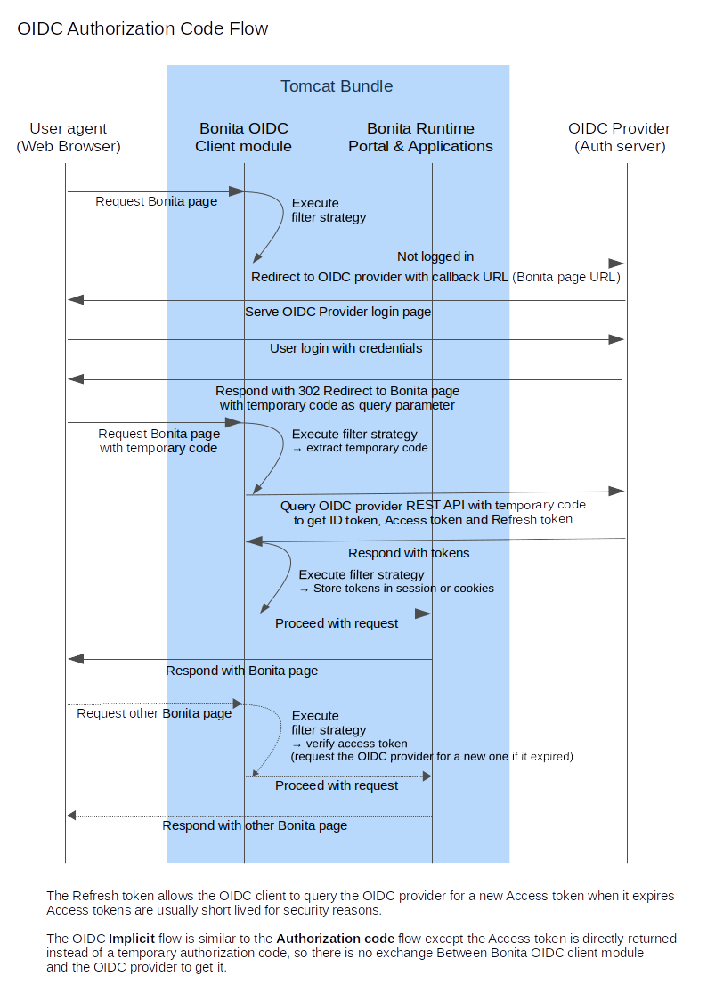

# OpenID Connect SSO configuration

Bonita can be configured to use the OpenID Connect (OIDC) protocol to provide single sign-on (SSO), as long as you already have an OpenID Connect Identity Provider server up and running (IdP). OIDC is an extension of OAuth 2.0. Contrary to the SSO support of SAML2, Both Bonita Web User Interface and Bonita REST API can be secured and accessed using the OIDC protocol as authentication mechanism (versus just the Web User Interface for SAML2). 

:::info 
**Note:** For Enterprise, Performance, Efficiency, and Teamwork editions only.
:::

This information applies to a Bonita platform deployed from a bundle, not to the Engine launched from Bonita Studio. `<BUNDLE_HOME>` refers to the root directory of the bundle.

OpenID Connect configuration is at tenant level. Each tenant can use a different authentication method (over OIDC or not).

:::info 
**Note:** Bonita uses [Keycloak](http://www.keycloak.org/) OIDC Service client adapter. It has been extended to support other OIDC providers than Keycloak.
:::

## OpenID Connect overview for Bonita

This is an overview that relates the steps required to integrate a bonita bundle with an OIDC Identity Provider.

<!--{.img-responsive}-->


Here some details about the Bonita OIDC module,
it is composed of: 

- A servlet filter that intercept all the requests to Bonita portal pages  

   It checks if the user is already logged in on Bonita
    
    - If already logged in => Allow the access
    - If not logged in => Redirect to IdP (with user info)

- An Implementation of the Authentication Manager extension point that retrieves the authentication information in the requests to log in to Bonita engine with the right credentials.  

::: warning  
 Bonita "username" should match the prefered_username or one attribute of the subject returned by the IdP in the response. 
 If some users need to be able to log in without having an account on the IdP, you can authorize it by activating an option in the file `authenticationManager-config.properties` (see 2. below). Users will then be able to log in using the portal login page (/login.jsp) provided they have a bonita account and their password is different from their username.  
 You can configure Bonita engine to create the accounts on the fly in the database once a user accessing Bonita has been authenticated with the IdP (see the configuration of `bonita-tenant-sp-custom.properties` in the 3rd section of the next chapter).
:::

## Configure Bonita Bundle for OIDC

You need to execute the following actions in the folder of each tenant for which you want to support authentication over OpenID Connect.
If you want this configuration to also apply to each tenant created later, make sure to also perform those actions in the *template* tenant configuration folder:
`<BUNDLE_HOME>/setup/platform_conf/current/tenant_template_*` (if you have not started the Bonita bundle yet, the files are located in `<BUNDLE_HOME>/setup/platform_conf/initial/tenant_template_*`)

The bundle already contains the files needed to use OIDC with Bonita platform.
To configure Bonita for OIDC:

1. If you do not already have one:
    1. Download a Subscription edition bundle from the customer portal
    1. [Configure](_basic-bonita-platform-installation) it as needed
    1. Run it a first time, so that the first default tenant is created (TENANT_ID = 1)
    1. Stop it before modifying the configuration files below
2. In the tenant_portal folder of each existing tenant: `<BUNDLE_HOME>/setup/platform_conf/current/tenants/<TENANT_ID>/tenant_portal`,
   edit the authenticationManager-config.properties as follows:
    ```
       -->  #auth.AuthenticationManager = org.bonitasoft.console.common.server.auth.impl.standard.StandardAuthenticationManagerImpl
            (...)
       -->  auth.AuthenticationManager = org.bonitasoft.console.common.server.auth.impl.oidc.OIDCAuthenticationManagerImpl
       -->  oidc.filter.active = true
       -->  oidc.auth.standard.allowed = true
       -->  oidc.logout.url = http://localhost:9090/auth/realms/bonita/protocol/openid-connect/logout
       -->  oidc.logout.url.redirectQuery = ?redirect_uri={encodedRedirectUri}
       -->  auth.tenant.admin.username = install
       -->  auth.passphrase = BonitaBPM
            (...)
       -->  auth.tenant.standard.whitelist = william.jobs
            (...)
       -->  logout.link.hidden=true 
    ```
    
    Make sure to [set the right tenant admin username](multi-tenancy-and-tenant-configuration#toc2).
    It is recommended to also replace the value of the passphrase (property auth.passphrase) which is used by the engine to verify the authentication request.
    The value must be the same as in the file **bonita-tenant-sp-custom.properties**.  
    If you need users to be able to log in without having an account on the IDP, you can authorize it by setting the property `oidc.auth.standard.allowed` to true. Users will then be able to log in using the portal login page (/login.jsp) provided they have a bonita account and their password is different from their username.  
    If only a limited group of users need to bypass OIDC authentication method you can restrain it by setting the property `oidc.auth.standard.allowed` to false and setting the property `auth.tenant.standard.whitelist` with the list of authorized usernames (comma separated). Otherwise you can keep it commented.

3. In the tenant_engine folder of each existing tenant: `<BUNDLE_HOME>/setup/platform_conf/current/tenants/<TENANT_ID>/tenant_engine/`
  edit the file bonita-tenant-sp-custom.properties as follows:
  
   ```
            # Authentication service to use. Some are natively provided:
            # authenticationService
            #   * binded to bonita authentication mode
            #   * impl: org.bonitasoft.engine.authentication.impl.AuthenticationServiceImpl
            # jaasAuthenticationService
            #   * to use JAAS
            #   * impl: com.bonitasoft.engine.authentication.impl.JAASGenericAuthenticationServiceImpl
            #   * this is the one to configure SSO over CAS (CAS properties to be defined hereafter
            # noAuthenticationService
            #   * does no authentication on the engine side
            #   * impl: com.bonitasoft.engine.authentication.impl.NoAuthenticationServiceImpl
            # passphraseOrPasswordAuthenticationService
            #   * Used by SSO implementations, login only if a passphrase is valid, or if a username/password is valid.
            #   * Requires PassphraseOrPasswordAuthenticationService bean to be uncommented in bonita-tenant-sp-custom.xml
            #   * impl: com.bonitasoft.engine.authentication.impl.PassphraseOrPasswordAuthenticationService
            # you can provide your own implementation in bonita-tenant-sp-custom.xml and refer to the bean name of your choice
       -->  authentication.service.ref.name=passphraseOrPasswordAuthenticationService
            
            # If authentication.service.ref.name equals "passphraseOrPasswordAuthenticationService",
            # you need to configure the following passphrase 
       -->  authentication.service.ref.passphrase=BonitaBPM
            
            # Create users on the fly, when they are missing from bonita but authenticated by the SSO. The user will belong to the group and role specified below.
            #authentication.passphraseOrPasswordAuthenticationService.createMissingUser.enable=true
            #authentication.passphraseOrPasswordAuthenticationService.createMissingUser.defaultMembershipGroupPath=/ACME/HR
            #authentication.passphraseOrPasswordAuthenticationService.createMissingUser.defaultMembershipRoleName=member
            
            # CAS authentication delegate : enables the user, providing login/password,
            # to be logged in automatically against CAS web application 
            # To be used in conjunction with the generic authentication service configured with CAS (jaasAuthenticationService)
            #authenticator.delegate=casAuthenticatorDelegate
            #authentication.delegate.cas.server.url.prefix=http://ip_address:port
            #authentication.delegate.cas.service.url=http://ip_address:port/bonita/loginservice
   ```
  
    It is recommended to also replace the value of the passphrase (property auth.passphrase). The value must be the same as in the file **authenticationManager-config.properties** updated previously.
    
    If you want Bonita engine to create the accounts on the fly once a user accessing Bonita has been authenticated with the IdP, you can uncomment the property `authentication.passphraseOrPasswordAuthenticationService.createMissingUser.enable` (and set its value to true) as well as the next 2 properties to add a default membership to each user account: 
    - `authentication.passphraseOrPasswordAuthenticationService.createMissingUser.defaultMembershipGroupPath` specify the group in which every user account created on the fly will be added (the full group path is needed)
    - `authentication.passphraseOrPasswordAuthenticationService.createMissingUser.defaultMembershipRoleName` specify the role to use to create the membership 

    **Note:** Activating this option means any user authorized by the IdP to access Bonita will have an account created automatically in Bonita Database.

4. If your OIDC Provider requires requests to be signed, generate a private key.
For example on linux, you can use the command ssh-keygen, then go to “cd ~/.ssh” to retrieve the key from the file id_rsa (more id_rsa, then copy the key).

::: info
**Note:** The expected format for Keys and certificates is PEM (with or without the comment header and footer).  
:::

5. In the tenant_portal folder of each existing tenant: `<BUNDLE_HOME>/setup/platform_conf/current/tenants/<TENANT_ID>/tenant_portal`,  
    edit the file **keycloak-oidc.json** to setup Bonita webapp as an OIDC client working with your OIDC provider.  
    ```
    {
      "realm": "master",
      "auth-server-url": "http://localhost:9090/auth",
      "auth-path": "/realms/{realm-name}/protocol/openid-connect/auth",
      "token-path": "/realms/{realm-name}/protocol/openid-connect/token",
      "token-service-logout-path": "/realms/{realm-name}/protocol/openid-connect/logout",
      "token-audience-path": "/realms/{realm-name}",
      "jwks-path": "/realms/{realm-name}/protocol/openid-connect/certs",
      "resource": "bonita",
      "ssl-required": "external",
      "principal-attribute": "preferred_username",
      "public-client": true,
      "autodetect-bearer-only": true,
      "enable-cors": true,
      "cors-allowed-methods": "POST, PUT, DELETE, GET"
    }
    ```
    + The property `realm` is only required if you use a Keycloak server as OIDC provider or if you want to benefit from the templating in the `-path` properties ({realm-name} will be replaced with the realm value). If you use a Keycloak server, make sure you set it with the name of the realm in which your Bonita OIDC client is/will be created.
    + `auth-server-url` is the base URL of the OIDC provider server. All other service endpoints are derived from this.
    + `auth-path` needs to be set with the path of your OIDC provider Authorization endpoint. It is prefixed with the value of `auth-server-url` to build the request URL. This property is specific to Bonita OIDC module and is not supported/documented by Keycloak.
    + `token-path` needs to be set with the path of your OIDC provider Token endpoint. It is prefixed with the value of `auth-server-url` to build the request URL. This property is specific to Bonita OIDC module and is not supported/documented by Keycloak.
    + `token-service-logout-path` needs to be set with the path of your OIDC provider Logout endpoint. It is prefixed with the value of `auth-server-url` to build the request URL. This property is specific to Bonita OIDC module and is not supported/documented by Keycloak.
    + `token-audience-path` needs to be set with the path of the URL that will be used as audience in the access token. It is prefixed with the value of `auth-server-url` to build the request URL. This property is specific to Bonita OIDC module and is not supported/documented by Keycloak.
    + `jwks-path` needs to be set with the path of your OIDC provider JSON Web Key Set endpoint. It is prefixed with the value of `auth-server-url` to build the request URL. This property is specific to Bonita OIDC module and is not supported/documented by Keycloak.
    + `resource` is the OIDC client Id given to your Bonita installation. You can change it if you want but you need to provide it to your OIDC provider.
    + the `ssl-required` property value may need to be changed if Bonita Portal and the IdP are not both accessed via HTTPS. Possible values for this property are: `all`, `external`, and `none`. For `all`, all requests must come in via HTTPS. For `external`, only non-private IP addresses must come over via HTTPS. For `none`, no requests are required to come over via HTTPS.
    + the `principal-attribute` value indicates the OIDC ID Token attribute (`preferred_username`, `email`, `name`, etc...) to use to be considered as user identifier in the client application. It should match the Bonita username
    + `public-client` indicates that there are no credentials for the client sent to the OIDC provider server.
    + `enable-cors` is required only if you wan to be able to use Bonita REST API from a web application located on a different domain from your Bonita installation's. It comes with additional options `cors-max-age`, `cors-allowed-methods`, `cors-allowed-headers`, `cors-exposed-headers`. You can check Keycloak [client adpter config documentation](https://www.keycloak.org/docs/latest/securing_apps/#_java_adapter_config) for more information.
    + Some additional properties no present in the default file can be useful:
      + `credentials` you can set it to `password` or `jwt` if Bonita client is configured with a 'Confidential' access type in the OIDC provider.
      + `connection-pool-size` for the pool of connection to the OIDC provider server (20 by default)
      + `truststore` path to a truststore file for OIDC provider servers requiring HTTPS. It should contain one or more trusted host certificates or certificate authorities. You can create this truststore by extracting the public certificate of the OIDC server’s SSL keystore. This property is mandatory if you OIDC provider requires HTTPS unless you set `disable-trust-manager` property to `true`. If the truststore requires a password, you also need to add the property `truststore-password`. 
      + `client-keystore` path to a keystore file containing client certificate for two-way SSL when the OIDC client adapter makes HTTPS requests to the OIDC provider server. You also need to add the properties `client-keystore-password` (password for the client keystore) and  `client-key-password` (password for the client’s key).
      + `token-store` indicates where the account information of the logged in user is stored on the client (Bonita bundle). By default it is `session` (HTTP session). `cookie` is also supported by the client adapter but it is not recommended to change it as all Bonita OIDC integration has been validated with the `session` setting.
      + `verify-token-audience` can be set to true to verify that the bearer token audience contains the client name (`resource ` property).

::: info
**Note:** More configuration options can be found in [Keycloak official documentation](https://www.keycloak.org/docs/latest/securing_apps/#_java_adapter_config)
:::

6. If your Identity Provider is corectly configured (see the section *Configure the Identity Provider*), you are done.
Then you can try to access a portal page, an app page or a form URL (or just `http://<host>:<port>/bonita[?tenant=<tenantId>]`) and make sure that you are redirected to your Identity Provider to log in (unless you are already logged in).  
Note that if you try to access `http://<bundle host>:<port>/bonita/login.jsp`, then you won't be redirected as this page still needs to be accessible in order for the tenant administrator (or another user if you set the property `oidc.auth.standard.allowed` to true) to be able to log in without an account on the Identity Provider.

::: warning
**Note:** If your Bonita platform is behind a proxy server, You need to make sure the reverse proxy is configured
to include the correct `Host:` header to the requests and the application server is configured to use this header (it is usually the case by default).
This is required so that `HttpServletRequest.getRequestURL` returns the URL used by the user and not the internal URL used by the reverse proxy.  
For example, if you are running Apache >=2.0.31 as reverse proxy, this configuration is controlled by the property [ProxyPreserveHost](http://httpd.apache.org/docs/2.2/mod/mod_proxy.html#proxypreservehost).
If you need more fine tuning or if you cannot update the reverse proxy configuration, you can consult the official documentation for [Tomcat](https://tomcat.apache.org/connectors-doc/common_howto/proxy.html)
:::

## Configure the Identity Provider

Your IdP should declare an OIDC Service Provider named (or whose client Id is) `bonita` (or the value of the `resource` property set in the file **keycloack-oidc.json** of Bonita bundle if it is different ) with the following configuration or the equivalent depending on your OIDC provider:

   ```
    "clientId": "bonita",
    "baseUrl": "<your bonita server URL>", (for example http://my.company.domain:8080/bonita)
    "adminUrl": "<your bonita server URL>/keycloak", (for example http://my.company.domain:8080/bonita/keycloak)
  this URL is used by the server to communicate directly with Bonita service provider (to push revocation policies for example))
    "clientAuthenticatorType": "client-secret", (can also be `client secret jwt`, `private key jwt`, etc... depending on your use case and security policies)
    "redirectUris": [
      "http://localhost:8080/*" (those are the valid redirect URLs)
    ],
    "bearerOnly": false,
    "publicClient": true,
    "consentRequired": false, (or true if you want the users to have to consent if a third party app uses Bonita REST API for example)
    "standardFlowEnabled": true,, (or false depending on your use case (if you need to use the implicit flow for example))
    "implicitFlowEnabled": false, (or true depending on your use case)
    "directAccessGrantsEnabled": true, (or false if you don't want to use the Resource Owner Credentials Grant type to access the REST API)
    "frontchannelLogout": true,
   ```

You may also define some token signature and encryption mechanism. In this case, make sure to update Bonita bundle configuration file **keycloack-oidc.json** accordingly.

::: info
**Note:** If the IdP declares a redirect/target URL, it might override the target URL set by the Service Provider request, and you may always end up on the same page after logging in. In that case, try to remove the redirect URL. Bonita supports redirection to the URL initially requested after logging in on the IdP, provided the IdP doesn't force this URL.
:::

## Configure logout behaviour

If your Bonita platform is configured to manage authentication over OIDC, when users log out of Bonita Portal, they do not log out of the OIDC Identity Provider (IdP).
Therefore they are not logged out of all applications that are using the OIDC provider.
To avoid this, you have two options :

#### Hide the logout button of the portal

This is the most commonly used solution. Users are logged in as long as they don't close their web browser (unless their session times out).
To do this, set the `logout.link.hidden` option to `true` in `authenticationManager-config.properties` located in `<BUNDLE_HOME>/setup/platform_conf/initial/tenant_template_portal` for not initialized platform or `<BUNDLE_HOME>/setup/platform_conf/current/tenant_template_portal` and `<BUNDLE_HOME>/setup/platform_conf/current/tenants/[TENANT_ID]/tenant_portal/`.

::: info
**Note:** When a user logs out from the IdP directly, Bonita Portal's session will remain active. The user's session time to live will be reset
to the configured session timeout value upon each user interaction with the server.
:::

#### Setup Bonita platform for OIDC logout

Global logout allows to log out from the OIDC provider as well as all the registered Service Providers when logging out from Bonita platform. This is sometimes required for example if users are on public computers.
As OIDC Providers do not necessarily support single logout and have different ways of handling it (there are several OIDC Single Logout methods), Bonita only offers OIDC logout through an OIDC logout URL that the IpP should provide and support.
To setup Bonita for OIDC logout:
1. Set the value of the property `oidc.logout.url` with your OIDC provider logout URL in `authenticationManager-config.properties` located in `<BUNDLE_HOME>/setup/platform_conf/initial/tenant_template_portal` for not initialized platform or `<BUNDLE_HOME>/setup/platform_conf/current/tenant_template_portal` and `<BUNDLE_HOME>/setup/platform_conf/current/tenants/<TENANT_ID>/tenant_portal/`.
2. If the logout URL of your OIDC provider supports a parameter to redirect after the logout, you can set the property `oidc.logout.url.redirectQuery` with the query string to use (it will be concatenated to the logout URL). The placeholder `{encodedRedirectUri}` will be replaced at runtime with the current Bonita URL at the time on the logout action.

::: info
**Note:** If the logout flow supported by your OIDC provider is not the same as the one supported by Bonita platform, the preferred solution to handle it anyway is to intercept the requests to /logoutService and handle the logout programmatically.
:::

## Troubleshoot

To troubleshoot SSO login issues, you need to increase the [log level](logging.md) to `ALL` for the packages `org.bonitasoft`, `com.bonitasoft`, and `org.keycloak` in order for errors to be displayed in the log files bonita-*.log (by default, they are not).

In order to do that in a Tomcat bundle, you need to edit the file `<BUNDLE_HOME>/server/conf/logging.properties.  
* Make sure the following lines are not commented or add them if they are not present :  
```
class\ org.keycloak.level = ALL
org.keycloak.level = ALL
```
* Update the existing lines (to set the level to `ALL`):  
```
org.bonitasoft.level = ALL
com.bonitasoft.level = ALL
```

Edit the *logger* tags which *category* matches `org.bonitasoft` and `com.bonitasoft` packages: change the *level* *name* attribute of each *logger* to `ALL` and add a new logger with the *category* `org.keyclock` (also with a *level* *name* set to `ALL`).

#### Common error examples

**Symptom:** After configuring OIDC SSO in Bonita, the Bonita Portal login page appears and you are not redirected to the SSO login page.  
**Possible Solutions:**
* Check all the Bonita configuration settings are correct.
* Make sure `setup[.sh][.bat] push` has been executed and the server restarted after the changes.
* Try cleaning the cache and cookies of the web browser.

**Symptom:** Bonita portal URL profile and page parameters (or any other) after the hash (#) are lost in redirections. As a result once the OIDC login page redirects back to Bonita portal, the portal displays the first page of the default profile.  
**Problem:** The hash part of an URL is not sent server-side. It only exists in the web browser. That explains this behavior.  
**Solution:**
The workaround is to put the parameters as regular URL query parameters. Bonita portal has a mechanism that will convert them to hash parameters if they need to be (this only works since version 7.8.1 of Bonita).  
For example instead of `<server_URL>/bonita/portal/homepage#?_p=caselistinguser&_pf=2`, use `<server_URL>/bonita/portal/homepage?_p=caselistinguser&_pf=2`

## Manage passwords

When your Bonita platform is configured to manage authentication over OIDC, the user password are managed in your OIDC Provider (IdP).
However, when you create a user in Bonita Portal, specifying a password is mandatory. This password is ignored when logging in with the OIDC provider.

## LDAP synchronizer and OIDC

If you are using an LDAP service and the [LDAP synchronizer](ldap-synchronizer.md) to manage your user data,   
you can continue to do this and manage authentication over OIDC.  
The LDAP synchronizer user must be registered in Bonita (no need for an OIDC account). It is recommended though to use the tenant admin account.
We recommend that you use LDAP as your master source for information, synchronizing the relevant information with your Bonita platform.

::: info
**Note :** By default the [LDAP synchronizer](ldap-synchronizer.md) sets the password of the accounts created with the same value as the username. So, even if you allow standard authentication (by setting the property `oidc.auth.standard.allowed` in **authenticationManager-config.properties**), users won't be able to log in with the portal login page directly without going through the OIDC provider authentication.   
:::

## Using Bonita REST API with OIDC

When Bonita web application is configured for authentication with OpenID Connect, Bonita REST API is secured through OIDC too and it is possible to call it with an Oauth Access token. 
To obtain the access token, there are several options depending on your OpenID provider configuration and you use case:  

1. Resource Owner Credentials Grant  
In this scenario, the client application that needs to use Bonita REST API performs a request to the token end point of the OIDC provider with the username and password of the user account to use in Bonita.  
For example, using a Keyclaok server as OIDC provider, with a realm named `bonita` and a client Id `bonitaOIDC`:

```
  POST /auth/realms/bonita/protocol/openid-connect/token  HTTP/1.1
  Host: localhost:9090
  Content-Type: application/x-www-form-urlencoded
  
  grant_type:password
  password:<user IdP password>
  username:<user IdP username>
  client_id:bonitaOIDC
```
   
2. Authorization Code or Implicit Grant  
Those scenarios work the same way as when you login on Bonita portal/apps except it is the client application that needs to use Bonita REST API which needs to trigger the authentication process by calling the OIDC provider authorisation endpoint with Bonita OIDC client as `client_id`. The rest of the scenario is similar to what is described in the OIDC Authorization Code Flow schema.  
Once you obtained the Access token, you can make your REST API request in a normal way, just adding a header `Authoritation` with value `Bearer <Access token>` (replace the placeholder <Access token> with the token returned by the OIDC provider and make sure to keep the whitespace after `Bearer`).
