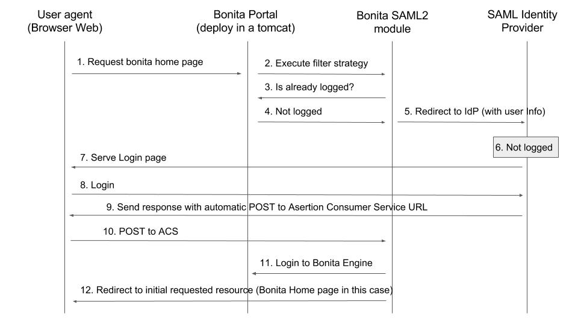

# Single sign-on with SAML

:::info 
**Note:** For Performance, Efficiency, and Teamwork editions only.
:::

This pages explains how to configure your Bonita Platform system to use the SAML protocol to provide single sign-on (SSO). It assumes you already have a SAML identity provider server up and running (IdP).

This information applies to a Bonita platform deployed from a bundle, not to the Engine launched from Bonita Studio.

SAML configuration is at tenant level. Each tenant can use a different authentication method (over SAML or not).

:::info 
**Note:** Bonita uses [Keycloak](http://www.keycloak.org/) as SAML service provider adapter.
:::

## SAML overview for Bonita

This is an overview that relates the steps required to integrate a bonita bundle with an SAML identity provider.

<!--{.img-responsive}-->


Here some details about the Bonita SAML2 module,
it is composed of: 

- A servlet filter that intercept all the requests to bonita portal pages  

   It checks if the user is already logged in on Bonita 
    
    - If already logged in => Allow the access
    - If not logged in => Redirect to IdP (with user info)


- One Assertion Consumer Service ACS URL (technically this is also handled by the servlet filter through a different URL mapping  `/saml`), 

    This service validates and process the SAML response :
    
    - Decode SAMLResponse
    - Check if the answer is valid (certificate, date, origin)
    - Extract the username from it (NameId or subject attribute)
    - Connect to bonita using username
    - Redirect to the initial requested resource (relayState)

::: warning  
 Bonita "username" should match the NameId or one attribute of the subject returned by the IdP in the response. 
 If some users need to be able to log in without having an account on the IDP, you can authorize it by activating an option in the file `authenticationManager-config.properties` (see 2. below). Users will then be able to log in using the portal login page (/loging.jsp) provided they have a bonita account and their password is different from their username.
:::

## Configure Bonita Bundle for SAML

You need to execute the following actions in the folder of each tenant for which you want to support authentication over SAML.
If you want this configuration to also apply to each tenant created later, make sure to also perform those actions in the *template* tenant configuration folder:
`setup/platform_conf/current/tenant_template_*` (if you have not started the Bonita bundle yet, the files are located in `setup/platform_conf/initial/tenant_template_*`)

The bundle already contains the files needed to use SAML with Bonita platform.  
To configure Bonita for SAML:

1. If you do not already have one:
    1. Download a Subscription edition bundle from the customer portal
    1. [Configure](_basic-bonita-platform-installation) it as needed
    1. Run it a first time, so that the first default tenant is created (TENANT_ID = 1)
    1. Stop it before modifying the configuration files below
2. In the tenant_portal folder of each existing tenant: `$TOMCAT_HOME/setup/platform_conf/current/tenants/<TENANT_ID>/tenant_portal`,
   edit the authenticationManager-config.properties as follows:
    ```
       -->  #auth.AuthenticationManager = org.bonitasoft.console.common.server.auth.impl.standard.StandardAuthenticationManagerImpl
       -->  auth.AuthenticationManager = org.bonitasoft.console.common.server.auth.impl.saml.SAML2AuthenticationManagerImpl
       -->  saml.filter.active = true
       -->  saml.auth.standard.allowed = false
       -->  auth.tenant.admin.username = install
       -->  auth.passphrase = BonitaBPM
            #auth.AuthenticationManager = org.bonitasoft.console.common.server.auth.impl.oauth.OAuthAuthenticationManagerImpl
            # OAuth.serviceProvider = LinkedIn
            # OAuth.consumerKey = ove2vcdjptar
            # OAuth.consumerSecret = vdaBrCmHvkgJoYz1
            # OAuth.callbackURL = http://127.0.0.1:8888/loginservice
            #auth.AuthenticationManager = org.bonitasoft.console.common.server.auth.impl.jaas.cas.CASRemoteAuthenticationManagerImpl
            # Cas.serverUrlPrefix = http://127.0.1.1:8180/cas
            # Cas.bonitaServiceURL = http://127.0.1.1:8080/bonita/loginservice
       -->  logout.link.hidden=true 
    ```
    
    Make sure to [set the right tenant admin username](multi-tenancy-and-tenant-configuration#toc2).
    It is recommended to also replace the value of the passphrase (property auth.passphrase) which is used by the engine to verify the authentication request.
    The value must be the same as in the file **bonita-tenant-sp-custom.properties**.  
    If you need some users to be able to log in without having an account on the IDP, you can authorize it by setting the property `saml.auth.standard.allowed` to true. Users will then be able to log in using the portal login page (/loging.jsp) provided they have a bonita account and their password is different from their username.

3. In the tenant_engine folder of each existing tenant: `$TOMCAT_HOME/setup/platform_conf/current/tenants/<TENANT_ID>/tenant_engine/`,
  edit the file **bonita-tenant-sp-custom.xml** to uncomment the bean passphraseOrPasswordAuthenticationService:

   ```
        <bean id="passphraseOrPasswordAuthenticationService" class="com.bonitasoft.engine.authentication.impl.PassphraseOrPasswordAuthenticationService" lazy-init="true">
           <constructor-arg name="logger" ref="tenantTechnicalLoggerService" />
           <constructor-arg name="identityService" ref="identityService" />
           <constructor-arg name="configuredPassphrase" value="${authentication.service.ref.passphrase}" />
       </bean>
   ```

4. In the tenant_engine folder of each existing tenant: “$TOMCAT_HOME/setup/platform_conf/current/tenants/<TENANT_ID>/tenant_engine/
  edit the file bonita-tenant-sp-custom.properties as follows:
  
   ```
            # Authentication service to use. Some are natively provided:
            # authenticationService
            #   * binded to bonita authentication mode
            #   * impl: org.bonitasoft.engine.authentication.impl.AuthenticationServiceImpl
            # jaasAuthenticationService
            #   * to use JAAS
            #   * impl: com.bonitasoft.engine.authentication.impl.JAASGenericAuthenticationServiceImpl
            #   * this is the one to configure SSO over CAS (CAS properties to be defined hereafter
            # noAuthenticationService
            #   * does no authentication on the engine side
            #   * impl: com.bonitasoft.engine.authentication.impl.NoAuthenticationServiceImpl
            # passphraseOrPasswordAuthenticationService
            #   * Used by SAML2 implementation, login only if a passphrase is valid, or if a username/password is valid.
            #   * Requires PassphraseOrPasswordAuthenticationService bean to be uncommented in bonita-tenant-sp-custom.xml
            #   * impl: com.bonitasoft.engine.authentication.impl.PassphraseOrPasswordAuthenticationService
            # you can provide your own implementation in bonita-tenant-sp-custom.xml and refer to the bean name of your choice
       -->  authentication.service.ref.name=passphraseOrPasswordAuthenticationService
            
            # If authentication.service.ref.name equals "PassphraseOrPasswordAuthenticationService",
            # you need to configure the following passphrase 
       -->  authentication.service.ref.passphrase=BonitaBPM
            
            # CAS authentication delegate : enables the user, providing login/password,
            # to be logged in automatically against CAS web application 
            # To be used in conjunction with the generic authentication service configured with CAS (jaasAuthenticationService)
            #authenticator.delegate=casAuthenticatorDelegate
            #authentication.delegate.cas.server.url.prefix=http://ip_address:port
            #authentication.delegate.cas.service.url=http://ip_address:port/bonita/loginservice
   ```
  
    It is recommended to also replace the value of the passphrase (property auth.passphrase). The value must be the same as in the file **authenticationManager-config.properties** updated previously.

5. If your Identity provider (IdP) requires requests to be signed, generate a private key.
For example on linux, you can use the command ssh-keygen, then go to “cd ~/.ssh” to retrieve the key from the file id_rsa (more id_rsa, then copy the key).

::: info
**Note:** The expected format for Keys and certificates is PEM (with or without the comment header and footer).  
:::

6. In the tenant_portal folder of each existing tenant: `$TOMCAT_HOME/setup/platform_conf/current/tenants/<TENANT_ID>/tenant_portal`,  
    edit the file **keycloak-saml.xml** to setup Bonita webapp as a Service provider working with your IdP.  
    + The entityID is the Service Provider given to your bonita installation. You can change it if you want but you need to provide it to your IdP.  
    + If your IdP requires the SSO requests to be signed replace the following strings in the Keys section of the SP:  
      - put your private key here
      - put your certificate here
    
      with you current server's private key and with the certificate provided by the IdP.  
      If your IdP does not require the SSO requests to be signed, you can remove the Keys node from the SP and set the attribute signRequest to false.  
    + If your IdP responses are signed, replace the following strings in the Keys section of the IDP:  
      - put your certificate here
      
      If your IdP responses are not signed, you can remove the Keys node from the IDP and set the attribute validateResponseSignature to false.  
    + The PrincipalNameMapping policy indicates how to retrieve the subject attribute that matches a bonita user account username from the IdP response.
      The policy can either be FROM_NAME_ID or FROM_ATTRIBUTE (in that case you need to specify the name of the subject attribute to use).  
    + You may also need to change the requestBinding and/or responseBinding from POST to REDIRECT depending on your IdP configuration.  
    + The url binding to your idp also needs to be define by replacing the following string:  
      - http://idp.saml.binding.url.to.change  

::: info
**Note:** More configuration options can be found in [Keycloak official documentation](https://keycloak.gitbooks.io/documentation/securing_apps/topics/saml/java/general-config.html)
:::
   
   ```
       <keycloak-saml-adapter>
           <SP entityID="bonita"
               sslPolicy="EXTERNAL"
               logoutPage="http://localhost:8080/bonita/logoutservice"
               forceAuthentication="false"
               isPassive="false"
               turnOffChangeSessionIdOnLogin="true">
               <Keys>
                   <Key signing="true">
        -->            <PrivateKeyPem>put your private key here</PrivateKeyPem>
        -->            <CertificatePem>put your certificate here</CertificatePem>
                   </Key>
               </Keys>
               <PrincipalNameMapping policy="FROM_ATTRIBUTE" attribute="username"/>
               <IDP entityID="idp">
                   <SingleSignOnService signRequest="true"
                      validateResponseSignature="true"
                      requestBinding="POST"
                      responseBinding="POST"
        -->           bindingUrl="http://idp.saml.binding.url.to.change"/>
                   <SingleLogoutService signRequest="false"
                      signResponse="false"
                      validateRequestSignature="false"
                      validateResponseSignature="false"
                      requestBinding="POST"
                      responseBinding="POST"
                      postBindingUrl="http://idp.saml.binding.url.to.change"
                      redirectBindingUrl="http://idp.saml.binding.url.to.change"/>
                   <Keys>
                       <Key signing="true">
        -->            <CertificatePem>put your certificate here</CertificatePem>
                       </Key>
                   </Keys>
               </IDP>
            </SP>
       </keycloak-saml-adapter>
   ```
7. If your Identity Provider is corectly configured (see the section *Configure the Identity provider*), you are done.  
Then you can try to access a portal page, an app page or a form URL (or just `http://<host>:<port>/bonita[?tenant=<tenantId>]`) and make sure that you are redirected to your Identity Provider to log in (unless you are already logged in).  
Note that if you try to access `http://<bundle host>:<port>/bonita/login.jsp`, then you won't be redirected as this page still needs to be accessible in order for the tenant administrator (or another user if you set the property `saml.auth.standard.allowed` to true) to be able to log in without an account on the Identity Provider.

::: info
**Note 1:** The single logout SAML profile is not supported by bonita as it doesn't work the same way for each IdP.  
So the SingleLogoutService configuration is not used (but the element still needs to be present in order for the filter to work...).  
:::

::: info
**Note 2:** If your Bonita platform is behind a proxy server, You need to make sure the reverse proxy is configured 
to include correct headers and application server is configured to use the headers. This is required so 
HttpServletRequest.getRequestURL returns the URL used by the user and not the internal URL used by the proxy.  
:::

## Configure the Identity provider

Your IdP should declare a Service Provider named `bonita` (or the value of the `entityID` set in the file **keycloack-saml.xml** of Bonita BPM bundle if it is different) with the following configuration:  
- ACS URL or SAML Processing URL: `http[s]://<bundle host>:<port>/bonita/saml`
- request binding and response binding configured with the same values as in **keycloack-saml.xml** (`POST` or `REDIRECT`)
- `Client signature required` configured with the same values as the property `signRequest` in **keycloack-saml.xml**
- if the IdP responses are signed, make sure the certificate of the IdP has been set in **keycloack-saml.xml**
- the Name ID or a user attribute of the user principal sent back by the IdP should match the username of the user accounts in Bonita BPM and the PrincipalNameMapping policy (and attribute value) in **keycloack-saml.xml** should reflect that

::: info
**Note:** If the IdP declares a redirect/target URL, it might orveride the target URL set by the service provider request, and you may always end up on the same page after logging in. In that case, try to remove the redirect URL. Bonita BPM supports redirection to the URL initially requested after logging in on the IdP provided the IdP doesn't force this URL.
:::

## Troubleshoot

To troubleshoot SSO login issues, you need to add a logging handler for the package `org.keycloak` and increase the [log level](logging.md) to `ALL` for the packages `org.bonitasoft`, `com.bonitasoft`, and `org.keycloak` in order for errors to be displayed in the log files bonita-*.log (by default, they are not).

In order to do that in a tomcat bundle (for example), you need to edit the file `server/conf/logging.properties.  
* Add the lines:  
```
org.keycloak.handlers = 5bonita.org.apache.juli.FileHandler
org.keycloak.level = ALL
```
* Update the existing lines (to set the level to `ALL`):  
```
org.bonitasoft.level = ALL
com.bonitasoft.level = ALL
```

## Configure logout behaviour

#### Bonita Portal

When your Bonita platform is configured to manage authentication over SAML, when users log out of Bonita Portal, they do not log out of the SAML Identity Provider (IdP).  
Therefore they are not logged out of all applications that are using the IdP.  
To avoid this, you can hide the logout option of the portal.  
To do this, set the `logout.link.hidden=true` option in `authenticationManager-config.properties` located in `platform_conf/initial/tenant_template_portal` 
for not initialized platform or `platform_conf/current/tenant_template_portal` and `platform_conf/current/tenants/[TENANT_ID]/tenant_portal/`.

::: info
**Note:** When a user logs out from the IdP, Bonita Portal's session will remain active. The user's session time to live will be reset 
to the configured session timeout value upon each user interaction with the server.
:::

## Manage passwords

When your Bonita platform is configured to manage authentication over SAML, the user password are managed in your SAML Identity provider (IdP).  
However, when you create a user in Bonita Portal, specifying a password is mandatory. This password is ignored.

## LDAP synchronizer and SAML

If you are using an LDAP service and the [LDAP synchronizer](ldap-synchronizer.md) to manage your user data,   
you can continue to do this and manage authentication over SAML.  
The LDAP synchronizer user must be registered in Bonita (no need for an SAML IdP account). It is recommended though to use the tenant admin account.   
We recommend that you use LDAP as your master source for information, synchronizing the relevant information with your Bonita platform.

::: info
**Note :** By default the [LDAP synchronizer](ldap-synchronizer.md) sets the password of the accounts created with the same value as the username. So, even if you allow standard authentication (by setting the property `saml.auth.standard.allowed` in **authenticationManager-config.properties**), users won't be able to log in with the portal login page directly without going through the IdP.   
:::

## Single sign-on with SAML using the REST API

SAML is a browser-oriented protocol (based on http automatic redirection, forms, etc...), therefore only resources that require a direct access from a web browser are handled by the SAML filter. 
Access to other resources won't trigger an SAML authentication process. 
Here is the subset of pages filtered by the SAML filter:

* /saml
* /samlLogout
* /portal/homepage
* /portal/resource/\*
* /portal/form/\*
* /mobile/\*
* /apps/\*

REST API are not part of them, but if an http session already exists thanks to cookies, REST API can be used.

The recommended way to authenticate to Bonita Portal to use the REST API is to use the [login service](rest-api-overview.md#bonita-authentication)..

