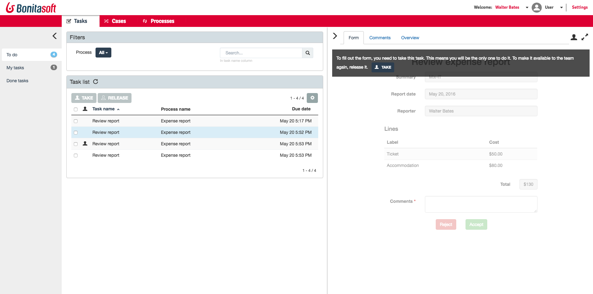

# Page title 

Here, write an overview of the content: 2 lines max to summarize the content of the page. Keywords and go right the the point, it's for SEO mostly. Example: This page explains how to use the Platform setup tool to configure the Bonita platform (properties, permissions, license install...).

<a id="anchor_to_reference_this_section_problem" />

## Needs description

* This page is a new template for support contribution
* It needs to be added in the dedicated folder that will be created by the admin

:::info
**Note:** You can use info section like this one. 
You could also need to put some monospace file names like that: `start-bonita.bat`(for Windows) or `start-bonita.sh` (for Unix).
Maybe you need bold font, so you put 2 asterisks * before and after the word.  
:::

You can use anchor if you need to make reference to a section, like that : `<a id="anchor_to_reference_this_section_problem" />`

<a id="platform_setup_tool" />

## Explanation

You can use dash points:
  - One
  - Two

You can make link to other pages like this `[Tomcat](tomcat-bundle.md)`, example : [Tomcat](tomcat-bundle.md).  

If you need a carriage return, you need to add 2 spaces after the .  

### Lower section 1

You can use bullet points, example:
* `platform_conf/`
    * `initial/`: contains the default configuration of Bonita Platform, that can be customized and will be pushed when the database is created.
    * `current/`: contains configuration files after a `pull` from the database is made.
    * `licenses/`: (Subscriptions only) folder to put the license file to allow Bonita Platform to start without error.
    * `sql/`: SQL scripts used to create Bonita database tables
* `database.properties`: used as a simplified entry form to get property values to connect to the database. Those values will be used by the file internal.properties.
* `internal.properties`: used internally by the setup tool to properly configure and initialize the bundle. It is made of both data entered in database.properties as well as other data like database driver class name, connection URL, etc. This file should not be modified manually in most cases, unless for specific use-cases like adding parameters in the connection URL or using a specific database driver.
* `setup.sh`: Unix / Mac script to run.
* `setup.bat`: Windows script to run.


### Lower section 2

More blabla, example:   
The script `setup` comes with 4 commands:

<a id="init_platform_conf" />

* `init`, to initialize the database

  It creates the database tables and pushes the initial configuration in the database.  
  This initial configuration is taken from the `platform_conf/initial` folder.  
  It is run by the global script `start_bonita`, but you can also insert it in your own scripts.
  
  Eg. `setup.sh init`  
  Eg. `setup.sh init -Ddb.vendor=postgres` (see [Advanced use](#advanced_use) for information on using `-D` properties)

You can also use warning or danger section: 

  ::: warning
  warning
  :::

  ::: danger
  danger
  :::
  
  Maybe you will need to add images or files, in that case, you need to:
  - Add the file in the images foder here: https://github.com/bonitasoft/bonita-doc/tree/7.8/md/images
  - Create a PR to add the file. 
  - The to reference it in this page, use the syntaxe: `<!--{.img-responsive}-->`, example: <!--{.img-responsive}-->

  ::: danger
  The image size is important, we need Nahalie's feedback to know the standard to use. 
  The image's weight should be less than 1 mega. 
  :::
  
  Or you may want to add a link to a youtube video, like this `[Bonita Camp - English - Part 1 - Bonita solution and components](https://www.youtube.com/watch?v=YG6clMUNPkk&list=PLvvoQatxaHOMHRiP7hFayNXTJNdxIEiYp&index=1)`, example:  [Bonita Camp - English - Part 1 - Bonita solution and components](https://www.youtube.com/watch?v=YG6clMUNPkk&list=PLvvoQatxaHOMHRiP7hFayNXTJNdxIEiYp&index=1)


## What about numbered list? 

Here is how to do so:
   1. Create the database
   2. Customize it so it works with Bonita
   3. Modify the `database.properties` file: Set the right db vendor and change connection url, user credentials, database name and so on.
   4. If you are using an Oracle or Microsoft SQL Server database, add the related [JDBC driver](database-configuration.md#proprietary_jdbc_drivers) in the `lib` folder. 


## What about code section? 

### Easy, just check that

e.g. for Unix command line:
```shell
./setup.sh configure -Ddb.vendor=postgres -Ddb.server.name=localhost -Ddb.server.port=5432 -Ddb.database.name=bonita \
-Ddb.user=bonita -Ddb.password=bpm -Dbdm.db.vendor=postgres -Dbdm.db.server.name=localhost -Dbdm.db.server.port=5432 \
-Dbdm.db.database.name=business_data -Dbdm.db.user=bonita -Dbdm.db.password=bpm
```

## Troubleshooting 

---

**Ok I think you got it**: If you need inspiration, check this page [Setup tool](BonitaBPM_platform_setup.md).  
And here are images example: [Portal interface overview](bonita-bpm-portal-interface-overview.md). 

---

**Have fun with the Bonita Documentation!**

---
