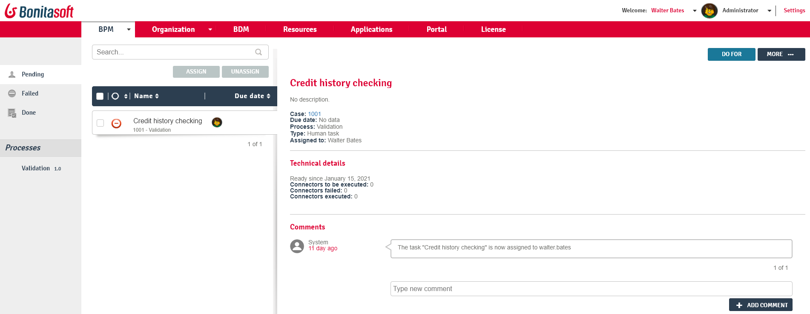

= Administrator Task list in Bonita Portal
:description: This page explains what a user with the _Administrator_ or _Process Manager_ profile in Bonita Portal can see and do about tasks and more generally, flow nodes. +

This page explains what a user with the _Administrator_ or _Process Manager_ profile in Bonita Portal can see and do about tasks and more generally, flow nodes. +
A flow node is an element of a process. It defines an action to be performed (automatic or human). A taks is a flow node done by a person.

Those users can view the list of flow nodes in error, pending tasks, done tasks, assign and unassign a task, do task for someone else, skip a failed flow node, replay a failed flow node, and write a comment about the case.

Here is a view of the task list:

// {.img-responsive}

== View tasks

Tasks are showns in three menu options on the left: _Pending_, _Failed_, and _Done_.
For each task, the priority and due date are shown in the list.

== Assign a task

A task can be assigned and reassigned if necessary to another user.

. Go to _BPM_>__Tasks__
. Click on the _Tick_ close to the task name
. Click on _Assign_
. In the popup, start typing the name of the user to assign the task to.
. Select the right suggestion
. Click on _Assign_

== Unassign a task

. Go to _BPM_>__Tasks__
. Click on the _Tick_ close to the task name
. Click on _Unassign_

== Do a task for another user

With the Efficiency, Performance and Enterprise editions, an Administrator can do a task for another user. +
This is useful for unblocking a case if the assigned user cannot perform a task.

. Go to _BPM_>__Tasks__ and view the list of pending human tasks.
. Select the relevant task in the list and click on _Do for_.
. In the popup, start typing the name of the user to the task for.
. Select the user for whom you want to do the task.
. Click on _Do it_.

The task is done and traced in the BPM database as though you have done the task on behalf of the selected user.

== Skip a failed task

If a failed task does not impact subsequent tasks in a process, it can be skipped. This means that the task does not have to be done successfully for the following steps to become available.

. Go to _BPM_>__Tasks__.
. Go to the _Failed_ menu option on the left.
. Click on a task.
. Click on the _More_ button.
. In "Technical details", the reason for the failure is displayed
. Click on the _Skip_ button.

The task is moved from "Failed" to "Done".

== Replay a failed task

This feature is available with the Enterprise or the Performance edition.
You will need to fix any parameter causing the failure *BEFORE* clicking on Replay.

. Go to _BPM_>__Tasks__.
. Go to the _Failed_ menu option on the left.
. Click on a task
. In _Technical details_, the details of the failure are displayed
. Click on _More_.
. Click on _Replay_.
. In the popup window _Replay task_, tick the task which failed.
. Click on _Replay_.

== View the failure stack-trace message on a failed task

Normally, a user will start a case of a process. The case might not start as expected. This is a called a failure.

In this case it is possible to check the failure on a connector:

. Go to _BPM_>__Tasks__
. Go to the _Failed_ menu option on the left. In _Technical details_, this shows the Connector has failed.
. Click on the _More_ button

image::images/images-6_0/connector_failed.png[failed]

. There can be a list of connectors in different states. Here we can see the connector that has failed.

image::images/images-6_0/connector_failed_details.png[failed]

. Click on the _Failed_ link. A pop-up window _Failure details_ displays the error message and the details of the message.

image::images/images-6_0/connector_failed_stack.png[failed]

There are 2 options:

* Either click on the _Skip_ button, to skip over the task where the connector failed. This will make the "Failed" message disappear on the Connector, and display "Resolved" instead.
* Fix the problem then click on _Replay_.
