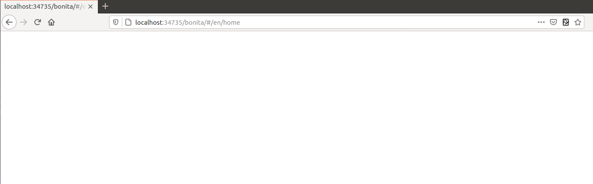
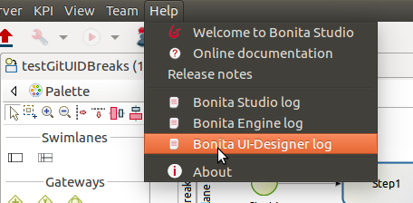

# Troubleshooting: My UI Designer is broken and return a 404 error or a blank page

You started your Studio today, and when you try to open a form from your process or open the UI Designer from the Studio, the UI Designer doesn't open and you see a 404 Error or a blank page. This page will help you fix this problem. 

## Problem

You started your Studio today, and when you try to open a form from your process or open the UI Designer from the Studio, the UI Designer doesn't open and you see a **404 Error** or a **blank page**.  

Instead of the form or the home page of the UI Designer, here's what you see in Chrome!  

<!--{.img-responsive}-->

Here's what you see Firefox, it's just a blank page!  

<!--{.img-responsive}-->

## How to identify the root cause?

The UI Designer has a log file that you can consult, either from the Studio Menu > Bonita UI-Designer log:  
<!--{.img-responsive}-->  
Or from your file system here: `STUDIO_HOME/workspace/.metadata/.plugins/org.bonitasoft.studio.designer/.extract/logs/ui-designer.log`.  
When reading the log file, you see this kind of error:  
```Could not load component, unexpected structure in the file [timelineWidget.json]```

Here is the full stack trace:  
```16:32:41 [localhost-startStop-1] ERROR o.s.w.c.ContextLoader - Context initialization failed  
org.bonitasoft.web.designer.repository.exception.NotFoundException: Could not load component, unexpected structure in the file [timelineWidget.json]  
[...] 
Wrapped by: org.bonitasoft.web.designer.rendering.GenerationException: Build error for timelineWidget.json  
[...]
Wrapped by: org.springframework.beans.factory.BeanCreationException: Error creating bean with name 'workspaceInitializer': Invocation of init method failed; nested exception is org.bonitasoft.web.designer.rendering.GenerationException: Build error for timelineWidget.json  
[...]
Wrapped by: org.springframework.beans.factory.UnsatisfiedDependencyException: Error creating bean with name 'migrationResource' defined in file [/home/marielle/BonitaStudioSubscription-7.11.1/workspace/.metadata/.plugins/org.bonitasoft.studio.designer/.extract/webapps/bonita/WEB-INF/classes/org/bonitasoft/web/designer/controller/MigrationResource.class]: Unsatisfied dependency expressed through constructor parameter 0; nested exception is org.springframework.beans.factory.BeanCreationException: Error creating bean with name 'workspaceInitializer': Invocation of init method failed; nested exception is org.bonitasoft.web.designer.rendering.GenerationException: Build error for timelineWidget.json  
[...]
```

## Why do you have this error?

Oops, some artifacts from the UI Designer got corrupted in your git repository!  

Most of the time, and this is the case in this example, it's because of a missing file in your repository. It may be for different reasons: switch on a wrong git branch, file deleted by error, wrong commit, ...

In the error above, for example, the log file says: "Could not load component, unexpected structure in the file [timelineWidget.json] ... Build error for timelineWidget.json".  

This means that the Widget timeline cannot be built correctly. In this case here, the file timelineWidget.tpl.html is missing from the folder 'web_widgets/timelineWidget' committed in the git repository.

Depending on the type of the file missing, other error messages could be (where "customInputTest" is the widget's name):
"Template not found for [customInputTest.tpl.html]"
"Controller not found for [customInputTest.ctrl.js]"

:::warning
The error message may vary depending on the Bonita version
:::

### Expected files for the different artifacts

If you extended the Input standard widget, and called it SmartInput.
You should have the following files in your <ProjectDir>/web_widgets directory:
```
customSmartInput (the custom widget directory)
	customSmartInput.ctrl.js
	customSmartInput.js
	customSmartInput.json
	customSmartInput.tpl.html
```

If you created a page called SmartPage:
You should have the following files in your <ProjectDir>/web_pages directory (the content may vary if you added some assets):
```
SmartPage (the page directory)
    SmartPage.json	assets/
    ./assets:
        css/	json/
    ./assets/css:
        style.css
    ./assets/json:
        localization.json
```

If you created a fragment called SmartFragment:
You should have the following files in your <ProjectDir>/web_fragments directory:
```
SmartFragment (the fragment directory)
	SmartFragment.js
	SmartFragment.json
```

### Error messages
#### Custom widget
- Custom widget missing 
    -  7.10 7.11 7.12
        ```
        NotFoundException: Could not load component, unexpected structure in the file [customSmartInput.json]
        ```
* Custom widget template file missing
    * 7.10
        ```
        NotFoundException: Could not load component, unexpected structure in the file [customSmartInput.json]
        ```
    * 7.11 7.12
        ```
        NotFoundException: Template not found for [customSmartInput.tpl.html]
        ```
* Custom widget json file missing
    * 7.10 7.11 7.12
        ```
        NotFoundException: Could not load component, unexpected structure in the file [customSmartInput.json]
        ```
* Custom widget json file syntax error
    * 7.10
        ```
        Unexpected exception while processing file /Applications/BonitaStudioSubscription-7.10.5.app/Contents/Eclipse/workspace/MyProject/web_widgets/customSmartInput/customSmartInput.json
        com.fasterxml.jackson.core.JsonParseException: Unexpected character
        ```
    * 7.11 7.12
        ```
        com.fasterxml.jackson.core.JsonParseException: Unexpected character
        ```    
* Custom widget controller file missing
    * 7.10
        ```
        NotFoundException: Could not load component, unexpected structure in the file [customSmartInput.json]
        ```    
    * 7.11 7.12
        ```
        NotFoundException: Controller not found for [customSmartInput.ctrl.js]
        ```    
* Custom widget js file missing
    * No error, file is re-generated

#### Fragment
* Fragment is missing (same error for all versions)
        ```
        NotFoundException: File not found: [SmartFragment.json]
        ```
* Fragment json file missing (same error for all versions)
        ```
        NotFoundException: File not found: [SmartFragment.json]
        ```
* Fragment js file missing
    * No error, file is re-generated
 

## Solution

In the case of a missing file, there are several ways to fix this error:

### 1- You are NOT using Git
* Option A: You have a backup of your repository and you can add the missing file in your repository again.
* Option B: If it's default widget, you can find the file in your local studio workspace and add it to your repository.

### 2- You ARE using Git
Here are some examples of common mistakes:
* You didn't pull the correct branch, you need to do the right pull. 
* You have a merge conflict, you need to fix that conflict. 
* Somebody removed a file by error
    * You can retrieve the file from a previous commit.
