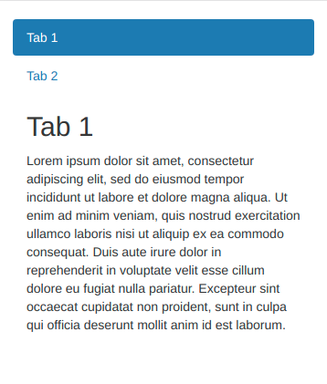
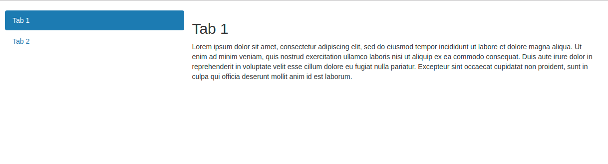

# How to display a vertical tabs container on all devices

::: warning
**:fa-exclamation-triangle: Warning:** This tutorial is using "Vertical tabs container" available since Bonita 7.9
:::

## Goal: Display stacked tabs on mobile and juxtaposed tabs on desktop
Since Bonita 7.9, tabs container can be configured "Vertically" by displaying tabs as "pills". This is useful for displaying tabs on mobile (tabs and contents are stacked) but not on large device (tabs content should be displayed on the right, not below). To have a tabs container well displayed on all devices, you just need to add some css rules as described below.

 <!--{.img-responsive .img-thumbnail}-->

 <!--{.img-responsive .img-thumbnail}-->

## Step 1: Configure the tabs container
The tabs container must be configured `Vertically` with type `pills` and must have a css class (for example tab-vertical) as follows:
 <!--{.img-responsive .img-thumbnail}-->

## Step 2: Add css rules in a css file
Add this following css rules in a new CSS asset or in an existing asset:
```css
@media (min-width:  768px) {
    .tab-vertical .nav {
        float: left;
        width: 30%;
    }

    .tab-vertical .tab-content {
        float: left;
        width: 70%;
    }
}
```
 <!--{.img-responsive .img-thumbnail}-->
