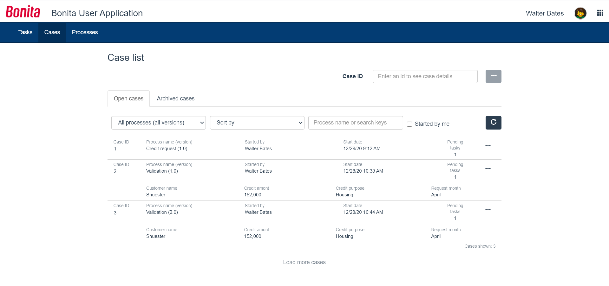
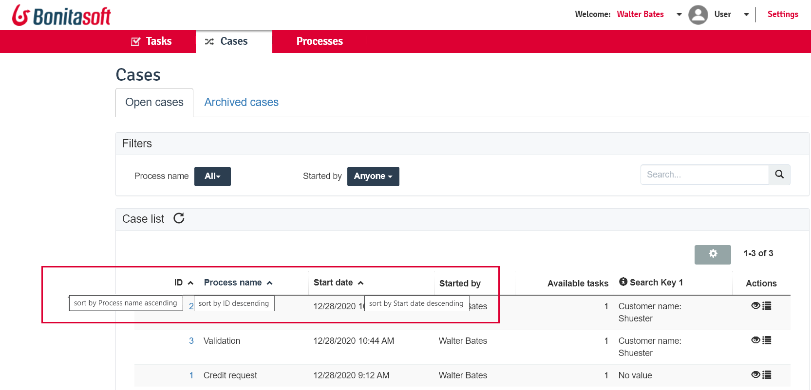
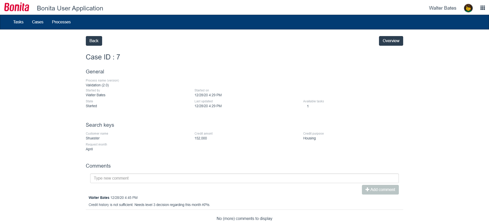
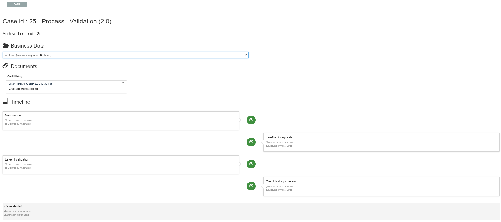

# User Case list in Bonita Application

This page explains what a user with the _User_ profile can see and do about cases (the process instances) in [Bonita User Application](user-application-overview.md).
It describes the value and details of the User Case List in Bonita User Application, as well as its related pages Case Details and Case Overview.  

This page has been created using our [R&D best practices](https://community.bonitasoft.com/blog/development-ui-designer-page-done-bonitasoft).

It features:
  * Search by Case Id, to access the details of a case directly
  * Repeatable containers, to better display the case search keys
  * "Load more" mechanism for better display performance
  * Displayed process version in the process filter, to make a more accurate choice in case several versions of a process must be distinguished

Here is a view of the User Case list
<!--{.img-responsive}-->

## Cases listed
As in the equivalent Portal page, the page displays the cases in which the logged in user has been involved:
  * They started the case, from the [process list](user-process-list.md) or another application
  * AND/OR they have done tasks in this case earlier, from the [task list](user-task-list.md) or another application

### Open and Archived cases
At the top of the page, two tabs act as the first filter of the list: _Open cases_ and _Archived cases_.  
Obvious differences between the two:
  * Open cases have an "Pending tasks" column but not the archived cases
  * Archived cases have an end date but not the open cases
  
Less obvious difference:
Users can add a comment in an open case, but cannot anymore in an archived case.  
Comments are described a little below in this page.

### Case information
Each case has been rendered in the form of a container, with the following information:
  * Case ID. It is clickable to navigate to the [case details](#case-details)
  * Process name (version). The process and version that has been started to give way to this instance
  * Started by. The initiator of the case
  * Start date. The date and time this case has been instantiated. It is displayed in the format of the logged in user locale or chosen application language.
  * Archived cases only: End date
  * Open cases only: Available tasks. Number of tasks the logged in user can do in this case at that very moment in the case lifetime (in the "To do" or "My tasks" basket)
  * "..." icon, to navigate to the [case details](#case-details)
  * If available for the case, the next row displays the case search keys (between 1 and 5)

### Filter by process name and version
Open and Archived case lists can be filtered by process name and version, in the "All processes (All versions)" drop down list.

### Filter by initiator
Open and Archived case lists can be filtered by the initiator of the case. By default, the lists display the cases started by anyone.  
By checking the "Started by me" checkbox, they are filtered by the logged in user as the initiator.  
To know more about how to set an entity of the organization as the initiator of a case, go to the [actors](actors.md) page, or check the [User process list](user-process-list) page.  
  
### Refresh
As time goes by, cases evolve by the action of other people or systems and the user needs an up-to-date vision of this status.
The "loop" icon, at the right of the filter by initiator, allows the user to refresh the case list. 

### Search by process name
In case the number of processes is very big, the user can also search by process name. This search will then act as a filter by process name.

### Search by search keys
::: info
This feature has been made available in the Community edition since Bonita 2021.1. It used to be only available in the Enterprise edition.
:::

#### Search keys

Search keys are data attached to the process definition to distinguish between cases of the process. For example: the customer's name for a request.  
It eases the search for a case if the case Id is not what users favor when referring to a case.  
They are instantiated through operations, mainly after the instantiation form has been submitted and the case starts.  
They can be updated anytime during the lifetime of the case.  
Search keys are optional and it is possible to define up to five search keys for a process.  
All available search keys are displayed for a given case.  
Technical note: A search key is translated by a database index in Bonita Engine.  
To know more about how to implement search keys, go to the [search keys](define-a-search-index.md) page. 

#### Search keys filter results

Only cases which have been given values for their search keys during the execution of the case will be filtered.
Search can be done on the value of a search key. In our example, not on "customer name" (the label), but on "Doe" (the value).
By default, the search is performed on the first word of the string.  
In case the string contains several words and you would need the search to be performed on the beginning of either word, you need to activate the [word-based search](using-list-and-search-methods.md#word_based_search).  
The search is launched automatically after a character is typed, with no need to press the Enter key.

### Search by Case Id
By entering the Id of a case and clicking the "..." button, the user gets to the [case details](#case-details) page directly.  
This search is active on both open and archived cases.  
Technically, cases change their Id when going from _open_ to _archived_ status. But users do not access this technical change. This is why the search is performed on both open and archived cases using the _original_ Id. For archived cases, it means the Id they had when they were open.  

### Sorting options
Sorting options are the same as in the equivalent Portal page, except they have been brought to the top of the page instead of in the table headers.
Here are the Portal sorting options.  
<!--{.img-responsive}-->

Here are the Application sorting options.  
<!--{.img-responsive}-->

The list can be sorted by:
  * Case Id (Ascending - Descending)
  * Process Name (Ascending - Descending)
  * Start Date (Newest first - Oldest first)
  * For archived cases only, End Date (Newest first - Oldest first)

### Pagination
By default, the list shows ten cases.  
A link at the bottom of the list says "Load more cases". When the user clicks on the link, it add ten more cases to the list, or just as many as remaining in the database for this filters configuration.  
The total number of cases displayed at a given time appears at the bottom right of the list, with the "Cases shown:" label fallowed by the number.  When this number is not a multiple of ten, that means that all cases available in the database for this filters configuration have been displayed.  
The "Load more cases" link cannot be clicked anymore.

<a id="case-details"/>

### Case details
This page has also been re-created with the UI Designer. It is responsive and customizable.
Here is an example of a case details page.
<!--{.img-responsive}-->

This page displays:
  * The case Id
  * The "General" information, already displayed in the list
  * An additional "Last updated" information. In an archived case, this information is the end date of the case
  * For open cases only, the "Available tasks" number is a link that navigates to the task list filtered by the case Id
  * The search keys, also displayed in the list
  * Comments written in the whole case lifetime, to read
  * For open cases only, an input field to add new comments for other actors of the case to read
  * A "Back" button to navigate back to the case list
  * An "Overview" button to navigate to the Case Overview.

## Case overview
This page has been created with the UI Designer. It is customizable.  
It displays:
  * The current values of the business variables of the case
  * The documents currently managed by the case
  * A bottom-up chronology of some events that happened in the case: case start and human tasks executed, each one with a timestamp and actor.

Is is used both in Bonita Portal and in Bonita Applications.  
Here is an example of the case overview provided by Bonita.
<!--{.img-responsive}-->

To know more about the customization of the case overview, go to the [Case overview](uid-case-overview-tutorial.md) page.
