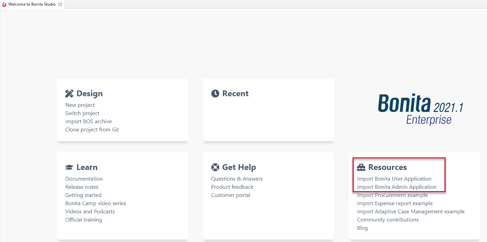

# Bonita User Application

This pages describes the Bonita User Application: its values, how to access it, its differences with the _User_ profile of Bonita Portal, and the details of its features.   
The Bonita User Application allows anyone with the _User_ profile to view tasks and do them, get information and add comments on cases, get a list of processes to start.

## Value
Bonita Portal is deprecated and will be removed in a future Bonita release.  
We believe that Bonita Applications give our users much more freedom for customization:
  * Their menus can be customized compared to provided Portal profiles, by adding or removing pages, while still keeping the mapping with the _User_ profile
  * Portal pages that have been re-created with the UI Designer have more features and/or features improvements  
  * These pages can also be modified in the UI Designer to fit precise users' needs.
  
We also want to remove the last parts of the platform that were still built with Google Web Toolkit framework; as useful as it has been when building Bonita Portal, we now find some limitations.  

## Access during Implementation
To get the application when you are implementing your Bonita project, go to the "Resources" tile of the **Studio Welcome page**, and click on "Import Bonita User Application".



You can also get it from our [User Application GitHub repository](https://github.com/bonitasoft/bonita-user-application/).  
There are two ways to get the .bos file. You can either get it from the *Releases* on the right or by cloning the repository of your choice and building it using maven.  
Building the repository will create a .bos file in the ```target``` folder. You can import this one into the development environment.
<br>Using this method is also useful if you want to get an older version of an application or if you need a weekly version with a potential bugfix.  

After Studio validation, the application is imported or cloned; you can view its content in the project explorer, deploy it, and open it.

## Access in pre-Production and in Production
To deploy the applications into a bundle or the Cloud, you can use [Bonita Continuous Delivery](https://documentation.bonitasoft.com/bcd//_manage_living_application).   

## Similarities and differences with _User_ profile of Bonita Portal
On top of the application values, here are the similarities and differences between application and Portal for the provided pages:
  * All pages previously created using Google Web Toolkit framework have been recreated with Bonita UI Designer. They can be customized in the UI Designer. They come with the Admin Application you download from Bonita Studio.
  * All pages previously created in other technologies have been wrapped as custom pages. They cannot be customized in the UI Designer. Since they cannot be imported in a .bos archive, they do not come with the Admin Application you downlaod. Instead, they come as provided resources. You can find them in the "Resources" tab of the application.

Now, in details: 
  * _Processes_: same as in Bonita Portal.
  * _Cases_: 
    * Case list: recreated with the UI Designer. It allows a much better display of search keys.
    * Case details: recreated with the UI Designer.
  * _Tasks_: same as in Bonita Portal.
  
## Create your own User application from ours
1. Have all your custom pages ready, either imported in Bonita UI Designer or Bonita Studio.
1. Open our UI Designer pages to customize them.
1. In Bonita Studio, go to the "Project explorer" on the left and double click on the "bonita-user-application.xml" application descriptor.
1. In the editor, rename the pages, change the order in the menu, remove the pages you do not need, add yours in the menu, or as orphan pages accessed through navigation from another page.
:::warning
Make sure our "details" pages are always used as orphan pages, as they need an id to be passed from a list or another page to show any content.
:::
1. To add other Bonita provided pages, open the portal from the coolbar, switch to the Administrator profile, and look in the "Resources" page, filtered by pages.

::: info
Once a page has been customized, or when the User application has been customized, it is no more supported.  
But you can reach one of our Professional Services team member to help you develop or maintain it.
:::  

## Login and sign out
To know more, go to the [dedicated page](log-in-and-log-out.md).
  
## Language selection
To know more, go to the [dedicated page](languages.md).

## Navigation between applications
To know more, go to the [dedicated page](navigation.md).
