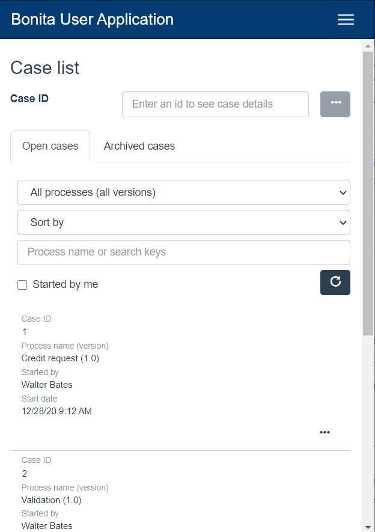

# Bonita User Application

This pages describes the Bonita User Application: its values, how to access it, its difference with the _User_ profile of Bonita Portal, and the details of its features. 

## Value
Bonita Portal is deprecated and will be removed in a future Bonita release.  
We believe that Bonita Applications give our users much more freedom for customization:
  * Their menus can be customized compared to provided Portal profiles, by adding or removing pages, while still keeping the mapping with the profile _User_
  * They are responsive
  * Portal pages that have been re-created with the UI Designer have more features and/or features improvements  
  * These pages can also be modified in the UI Designer to fit precise users' needs.

The Bonita User Application allows anyone with the _User_ profile to interact at user level with processes, cases, and tasks.

## Access during Implementation
To get the application during the project Implementation phase, go to the "Resources" tile of the **Studio Welcome page**, and click on "Import Bonita User Application".
After validation, you can import the application, deploy it, and open it.

## Access during pre-Production and Production
### Cloud
### On premises

## Differences with _User_ profile of Bonita Portal
On top of the application values, here are the differences between application and Portal for the provided pages:
  * _Process_ page is the same than the [Portal process](user-process-list.md) page. It is made in _React_ and cannot be customized with the UI Designer yet.
  * _Case_ page has been recreated with the UI Designer to implement some improvements. It can be customized with the UI Designer. For more details, go to the [User Case List in Bonita Application](user-application-case-list.md) page.
  * _Task_ page is the same than the [Portal task](user-task-list.md) page. It is made in AngularJS and cannot be customized with the UI Designer yet.

## Responsiveness
Bonita applications have been developped using the responsiveness feature of the UI Designer, as explained [in this page](create-or-modify-a-page.md).  
Their layouts [adapt to the screen size](bonita-layout.md), and their pages display well in all of the four supported screen sizes.  
Here is an example of the case list viewed in a mobile screen size.
<!--{.img-responsive}-->
This is why the Mobile Portal will has been deprecated and will soon be removed from Bonita.  

## Login and sign out
To know more, go to the [dedicated page](log-in-and-log-out.md).
  
## Language selection
To know more, go to the [dedicated page](languages.md).

## Navigation between applications
To know more, go to the [dedicated page](navigation.md).

