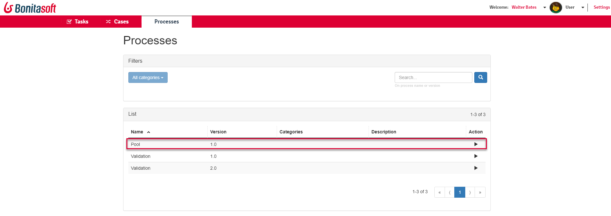
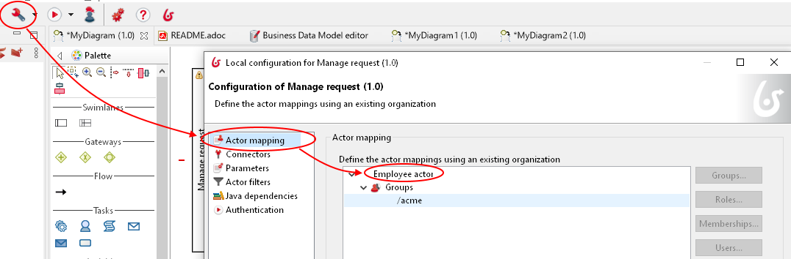
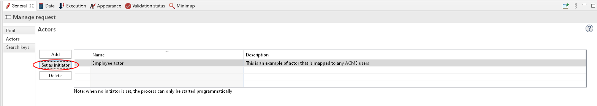

# Portal processes for users

This page explains what a user with the User profile in Bonita Portal can see and do about processes.

_Users_ can view a list of the processes they have the permission to start, and start a new instance of a process.

## Process list

<!--{.img-responsive}-->

This list displays the processes that the logged user can start.  
This propoerty has been stated in the Studio, by mapping the _initiator_ actor of the pool with entities of the organization the user is part of.

<!--{.img-responsive}-->
<!--{.img-responsive}-->

## Start a process

To start a new instance of the process, also named _case_:
1. Click on the arrow at the end of the process row or anywhere on this row.  
   This navigates to the instantiation form of the process.  
2. Fill in or select the information requested.  
   At that step, the process is not instantiated yet.   
   That means that you can click in the left part of the instantiation form to come back to the list without the need to cancel a case.  
3. Click on the button ("Submit" or else)
   The instance is created.

To know more about the creation of the process instantiation form, go to the [Getting started tutorial](create-web-user-interfaces.md)
