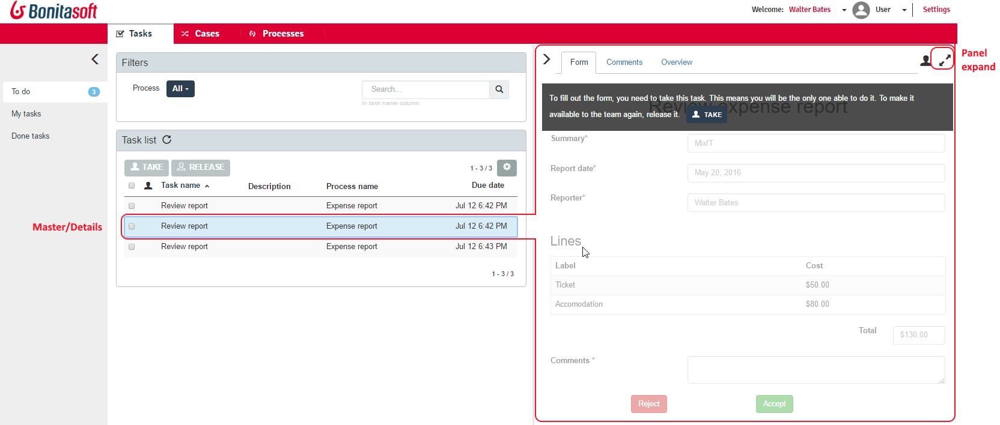
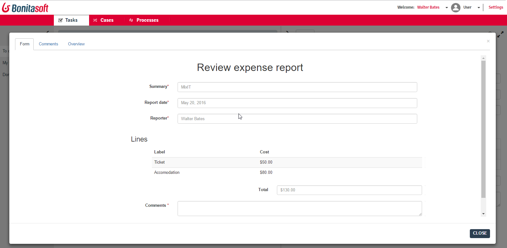

# User task list

This page explains what a user with the User profile in Bonita Portal or in [Bonita User Application](user-application-overview.md) can see and do about tasks.  
_Users_ can view lists of tasks to do as a member of a team, view tasks precisely assigned to them, view tasks they have done related to different processes, take and release tasks, and do tasks, eventually.

## Overview

Starting with Bonita 7.3, users benefit from a configurable task list, to manage tasks involving human actors from all processes in a more efficient fashion.
This page is also made available as a custom page in Bonita Portal > _Resources_, to be used in any [application](applications.md) or [custom profiles](profile-list-portal.md), for users types of profiles.

Here are the values of the user task list:
  * Default Master/Detail design pattern, to view list and form in the same screen
  * _Panel expand_ feature, to display wide forms in a large modal window

<!--{.img-responsive .img-thumbnail}-->
<!--{.img-responsive .img-thumbnail}-->

  * List settings: number of tasks in a page, choice of columns, columns ordering
  * Easy access to case information, one tab away from the form. This case information is the case overview page, that the development team can customize
  * Easy access to case comments, also one tab away from the form or case information

<!--{.img-responsive .img-thumbnail}-->

  * Alternate "full width" list, with task information displayed in a large modal window

<!--{.img-responsive .img-thumbnail}-->

This list also leverages two legacy features (prior to Bonita 7.3.0):
  * [Dynamic task display name](optimize-user-tasklist.md), for efficient task identification (insert business values in task name)
  * [Word-based search](using-list-and-search-methods.md#word_based_search), for efficient task name search (search for any word in the task name)

The task list also contains a _Done tasks_ filter, for the user to check if the task has been completed properly.

::: info
**Note:** Since Bonita 7.3.0, creating subtasks is no longer possible. However, if subtasks have been created in a process instance in an old Bonita version, and if the Bonita Platform has been migrated to a later version while the case was open, then the subtasks will still be visible to the users assigned, and users will still be able to complete them.
:::
