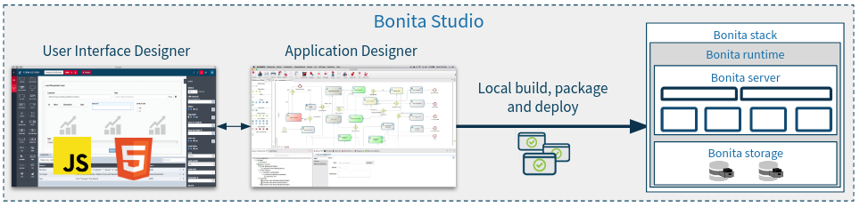

# What is Bonita?

Welcome to this Bonita getting started tutorial. On this page you will find a quick overview of what you can do with Bonita and an introduction to the Bonita architecture.

If you can't wait to start creating your first application with Bonita, you can safely skip this page and move to the [download and installation](bonita-studio-download-installation.md) of Bonita Studio.

## What can I do with Bonita?

Bonita is a Digital Process Automation (DPA) platform that allows you to create applications based on processes. Processes can be partially automated (if involving users) or fully automated.

DPA, available with all Bonita editions, is applicable to a wide range of use cases: applications can go from loan request management, to student application processes, to analytical processes in drug discovery - and more! You can find the various industries where Bonita is used as well as use cases from our [website dedicated page](https://www.bonitasoft.com/industries).

Starting with Bonita 7.10, you can also handle Adaptive Case Management with Bonita. 
ACM (Adaptive or Advanced Case Management) is like DPA in the sense that it allows to handle cases with some automation. But it also relies on strong principles that make it different from DPA: 
  - Empower the actors: 
  Actors in charge of the case have some autonomy to lead the case to its closure: not all process paths are pre-determined. Some tasks are optional, some are discretionnary. Actors' specific knowledge make them fully able to choose the right next action for a case. 
  - Expect the unexpected: 
  A case can be stopped, resumed and can even change its state at any time without a path being predefined. New tasks may need to be created on the fly to reflect the specificity of a case while still benefiting from traceability.
  - Adapt to the context: case type and state define the availability of tasks following a set of business rules. Those rules must be editable on the fly.
  - Center on data: Case execution is not centered around a strict process, but around case data to create and update.

ACM, available in Teamwork, Efficiency, Performance and Enterprise editions, is applicable to use cases including problem investigations  (like insurance claims), audits or decision making procedures.

To learn more about how to use ACM capabilities in Bonita, check the [documentation](use-bonita-acm.md).

## How do I create a Bonita application?

Thanks to the low-code Bonita platform you won't need to write a lot of code to create an application. Creation of Bonita applications relies heavily on models: a process model (using BPMN standard), a data model for business data management, a WYSIWYG tool for user interface design, and more.

Creating an application in Bonita Studio (the Bonita development environment) requires the following steps:

- graphically design one or several processes using BPMN notation
- define the data model using the Bonita Business Data Management feature (you can of course use your own database if needed)
- create web user interfaces using the Bonita UI Designer (or your preferred web framework)
- define users involved in the process
- configure connectors to integrate Bonita with the information system (e.g. to send an email, call a web service, and more.)

We will cover these steps in this getting started tutorial so you can get familiar with the concepts behind a Bonita application.

## Overview of the Bonita solution architecture

### Bonita Studio

<!--{.img-responsive .img-thumbnail}-->

Bonita Studio provides everything you need to develop and build a Bonita application. Bonita Studio is a desktop application built on Eclipse.

It provides:

- capabilities to model BPMN (Business Process Modeling Notation) processes
- capabilities to model BDM (Business Data Model)
- capabilities to model user interfaces (UI Designer)
- capabilities to model applications
- an embedded Bonita stack (defined below), exclusively dedicated to local application testing performed by the application developer.

Bonita Studio is not intended for any use other than development. As a consequence, the Bonita stack embedded into the Bonita Studio can not be used for production purposes.

### Bonita stack, runtime and server

<!--{.img-responsive .img-thumbnail}-->

The "Bonita stack" refers to all the components you need to deploy in order to make applications available to end users in production. It includes the Bonita runtime and the two database schemas (one for the Bonita Engine and one for business data).

The Bonita runtime includes a single Bonita server in the Bonita Community Edition. In the Bonita Enterprise Edition, the Bonita runtime can include several Bonita servers to create a cluster for high performance and availability.

The Bonita server has two components: the Bonita Engine that manages process execution, and the web portal which provides the end user's and administration user's web interfaces.

The Bonita server is a standalone Java application running in a Java application server installed on a host (a machine, a virtual machine, a cloud instance, a container like Docker, etc).

Now that you have the global picture of Bonita, you are ready to move on to the next step: [download and install Bonita Studio](bonita-studio-download-installation.md).
